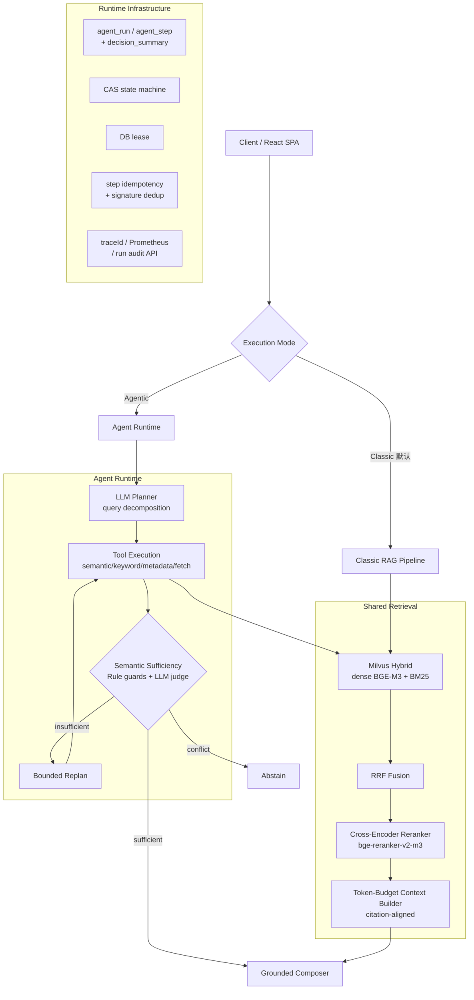
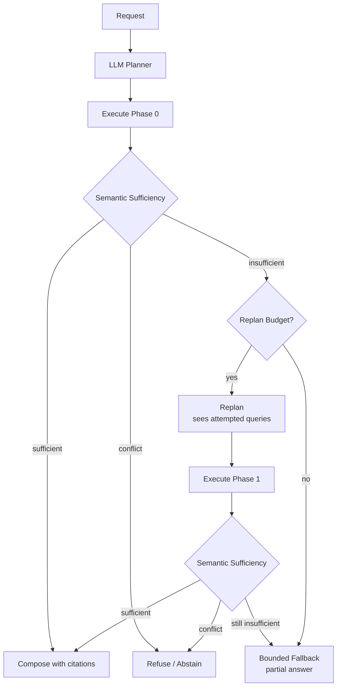
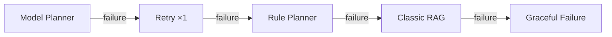

# rag-doc-platform (kiwi-doc)

> **An evaluation-driven Agentic RAG system** with hybrid retrieval, bounded Plan–Execute–Replan,
> semantic sufficiency control, durable execution state, runtime fallback, and end-to-end observability.

    

评测驱动开发的私有知识库问答系统。与"直接拼装 RAG/Agent Demo"的区别在于：本项目**测量了
Agentic 控制环什么时候真正提升检索质量、什么时候其延迟与 LLM 成本不划算**——并用数据做出了
默认执行模式的架构决策。

[Architecture](#system-architecture) · [Evaluation](#evaluation) · [Quick Start](#quick-start) · [中文文档入口](#documentation)

---

## Why This Project

```text
Classic RAG:   Query → Retrieve → Rerank → Generate

Agentic RAG:   Query → Plan → Execute → Semantic Sufficiency
                        ↑                    ↓
                        └── Replan (if insufficient) ──→ Answer / Abstain / Fallback
```

核心问题：

> **When does the additional Agentic control loop actually improve retrieval,
> and when is Classic RAG the better engineering choice?**

回答这个问题需要的不是更大的 Demo，而是：可逐样本核验的评测、机制级的调试、
以及一个诚实的默认决策。本项目的答案浓缩在 [Evaluation](#evaluation) 一节。

---

## System Architecture



- **MySQL 为事实源，Milvus 为派生索引**（召回后逐条回库校验租户/软删/generation）
- 异步索引链路：outbox → RocketMQ → parser-service（租约 + visibility timeout + 对账，kill -9 演练验证）
- 安全：Deny-by-Default 认证 + 文档/块双层 ACL + prompt 注入双层防御

## Agent Runtime



Bounded by: **step budget · replan budget (1) · token budget · deadline**。
每一次终止都能事后重建：`agent_run.decision_summary` 区分
`INITIAL_SUFFICIENT / REPLAN_SUFFICIENT / REPLAN_EXHAUSTED_FALLBACK / REFUSED_CONFLICT / TOOL_FAILURE`。

## Runtime Degradation



每一级降级可观测：`reasonCode` · `planner_source`（逐样本落库）· `traceId` · Prometheus 指标。
评测（REPLAY）模式下夹具缺失严格失败、**不降级**——防止评测对象漂移。

---

## Key Engineering Highlights

- **Hybrid Retrieval & Context Construction** — dense(BGE-M3)+BM25 RRF 融合 → cross-encoder
  GPU 重排 → token/字符双闸门预算装填 + 引用编号对齐；Contextual Retrieval 入库前缀。
- **Bounded Plan–Execute–Replan** — LLM 查询分解、需求冻结、语义充分性判定（Rule 确定性守卫 +
  LLM 语义判定）、有界 replan（能看到已尝试的查询）、四重预算终止。
- **Failure-aware Runtime** — Planner 四级降级链（上图）；每级有独立 reasonCode/日志/指标，零静默降级。
- **Durable Execution** — `agent_run`/`agent_step` 持久化 + CAS 状态机 + DB lease +
  checkpoint 落库 + 步级幂等（sha256 幂等键 + 工具签名去重）。resume 续跑未接线（stale run
  安全终止），不声称 automatic resume。
- **Semantic Control** — 修复后的 Sufficiency 分层：Rule 只判 NO_EVIDENCE/实体过滤不匹配/
  版本冲突三类确定性事实，语义充分性归 LLM judge（holdout 实测 human agreement
  42%→**96%**，false-sufficient 100%→**4%**）；矛盾证据保守 abstain。
- **Evaluation Infrastructure** — 配对评测 + 逐样本 planner_source 隔离 + 盲评换位双 judge +
  bootstrap CI + common-cohort 固定分母 + 有效性门槛（MODEL 样本 <80% 禁止下结论）。
- **Observability** — traceId/requestId/runId 三级关联（sync 头与 SSE 终态事件同语义、
  从不伪造 runId）；Prometheus agent 域指标（每指标单一权威记录点）；
  `GET /api/v1/agent/runs/{id}` 全步骤审计 API。

---

## Evaluation

Classic 与 Agentic 共享同一 retrieval / reranker / generator / judge 基础；配对评测、
逐样本 planner_source 核验、盲评位置互换、bootstrap 95% CI、固定共同 cohort（46 题）。

### 冻结结果（common-cohort audit，2026-08-27）

| System | Overall vs Classic | Multi-hop vs Classic | Relative Latency |
|---|---:|---:|---:|
| Classic RAG | baseline | baseline | 1.0× |
| Pre-fix Agentic (LLM Planner) | **-8.3pp** * | -10.0pp * | ~2.7× |
| Post-fix Agentic | **-0.2pp** (n.s.) | +2.3pp (n.s.) | ~2.8× |

\* 95% CI 不含 0（Pre-fix: [-16.7, -1.5]pp）；Post-fix CI [-8.9, +8.9]pp。
修复本身：Post-fix − Pre-fix = **+5.7pp**，CI [+0.9, +11.7]pp，显著。

- 语义 replan 在 **21%（10/48）** 的样本上触发——恰好是证据真正不足处（该子集 Classic 仅 0.79），
  并在其中有正向信号（n=10，方向真实、个体不显著）；其余 79% 正确地不触发。
- 成本：约 **2.8× 延迟**、**3.4 次 LLM 调用/run**。
- Classic 自身基线（80 题冻结集）：faithfulness **0.885** / recall **0.90**。

> **After fixing the Agentic control loop, quality recovered from a significant deficit
> to statistical parity with Classic RAG. However, the additional latency and LLM cost
> still do not justify enabling Agentic mode by default.**

**Default execution mode: Classic RAG** —— 这是数据驱动的工程判断，不是失败。

## What We Learned

1. **Evaluation identity matters** —— 第一轮 200 题×3 轮实验实际生效的是规则模板 Planner
   而非 LLM Planner（配置漂移）。为此建立了 `planner_source` 逐样本核验、REPLAY 严格失败、
   有效性门槛与 common-cohort 分析——评测结论的可信度取决于"你确定测的是你以为的东西"。
2. **Agentic failures were mechanism failures** —— 三个被实测定位并修复的结构缺陷：
   D1 Model replan step-id 命名空间冲突（replan 100% 失效）、D2 replan 看不到已尝试的查询、
   D3 Rule sufficiency 存在性检查造成构造性 false-sufficient（47/47 零 replan 根因）。
   → [Full mechanism audit](docs/evaluation/2026-08-27-postd3-residual-audit.md)
3. **More agentic is not automatically better** —— 修复后整体平手、多跳出现正向信号，
   但 ×2.8 延迟与 3.4 次 LLM 调用/run 的成本在当前语料不划算，因此默认保持 Classic。

## Design Decisions

- **Why Classic is still the default** — 质量统计平手，成本显著更高（~2.8× 延迟、~3.4 LLM
  calls/run）。开启 Agentic 需要的正向收益证据尚未出现。
- **Why no query-level Agentic router** — 当前不存在稳定的 query 级 pre-routing 特征；
  semantic insufficiency 是 **post-execution / escalation 信号**而非 query 特征。
  唯一证据对齐的形态是 retrieval-first escalation，其收益上限（+0.6pp）未证明值得成本，故不实现。
- **Why no long-term memory** — 当前业务不依赖跨会话用户记忆。已有的是会话级管理
  （contextualization / history compression / topic-shift detection / Redis TTL），
  不声称完整 Long-term Memory。

## Reliability & Observability

| Concern | Implementation |
|---|---|
| State transition | CAS (version + expected-status) |
| Execution ownership | DB lease (claim / heartbeat / release) |
| Duplicate execution | step idempotency key + tool signature dedup |
| Planner failure | Model → Retry → Rule → Classic → graceful failure |
| Semantic insufficiency | bounded replan (1), then partial-answer fallback |
| Evidence conflict | conservative abstain (REFUSED_CONFLICT) |
| Durable audit | agent_run / agent_step / decision_summary |
| Correlation | traceId / requestId / runId (sync headers ⇄ SSE parity) |
| Metrics | Prometheus agent domain (single authoritative site per metric) |

---

## Quick Start

前置：JDK 17、Docker 24+（compose v2）。所有命令见 [Makefile](Makefile)。

```bash
# 1. 配置
make env                      # 从 .env.example 复制 .env（填 LLM_API_KEY 等）

# 2. 起中间件（MySQL/Redis/MinIO/Milvus/RocketMQ）
make up && make ps

# 3. 起 chat-app
make run                      # http://localhost:8080
```

### 两种检索模式（真实配置，无漂移）

```text
Minimal Mode（无 GPU）: RAG_RERANK_ENABLED=false        → hybrid 检索，功能完整
Full Mode:              reranker 服务 + 隧道 18080       → 见 docs/operations/autodl-reranker-sop.md
```

### 发一个请求并检查一次 Agent run

```bash
# Classic（默认）
curl -s localhost:8080/api/v1/chat -H "Authorization: Bearer $TOKEN" \
  -H "Content-Type: application/json" \
  -d '{"query":"Seata AT 模式回滚依赖什么表","mode":"RAG","top_k":5}'

# Agentic（需显式开启: RAG_AGENT_PLANNER_ENABLED=true
#          RAG_AGENT_PLANNED_PIPELINE_ENABLED=true, 默认均为 false）
curl -s -D headers.txt localhost:8080/api/v1/chat -H "Authorization: Bearer $TOKEN" \
  -H "Content-Type: application/json" \
  -d '{"query":"...","mode":"AGENTIC","top_k":5}'
grep X-Agent headers.txt     # X-Agent-Run-Id / Terminal-Status / Decision-Summary

# 审计这次运行（步骤/状态/耗时/planner来源/决策摘要）
curl -s -H "Authorization: Bearer $TOKEN" \
  localhost:8080/api/v1/agent/runs/$RUN_ID
```

前端 SPA：`cd frontend && npm install && npm run dev`（Vite 代理到 8080，详见
[frontend/README.md](frontend/README.md)）。异步解析模式、Langfuse、CI/评测门禁见 docs。

---

## Project Structure

```text
platform-common/      共享层（domain / ports / chunking）
platform-bootstrap/   chat-app 主模块（interfaces / application / infrastructure）
parser-service/       异步解析服务（RocketMQ + chunk 级 checkpoint）
frontend/             React 19 SPA（SSE 流式 / 引用卡片 / Agent 步骤可视化）
deploy/               docker-compose（中间件 + RocketMQ）+ nginx
eval/                 评测脚本 + 冻结基线（agentic/ 下含 paired A/B runner 与报告）
docs/                 adr(15) / architecture / evaluation / operations / v3 / research
```

## Documentation

| 主题 | 入口 |
|---|---|
| Architecture / 机制审计 | `docs/architecture/` · `docs/adr/` |
| 评测方法与全部报告 | `docs/evaluation/`（P0-2 spec/pilot、Post-D3 验证、E1/E2 残差审计） |
| 可靠性 runbook | `docs/operations/`（reranker SOP / eval 回归 SOP / prod runbook） |
| 修复闭环全记录 | `docs/architecture/agent-architecture-fix-plan.md`（含 P0-3 修订注记） |
| V3 spec / 验收 | `docs/v3/` |
| 前端 | `frontend/README.md` |
