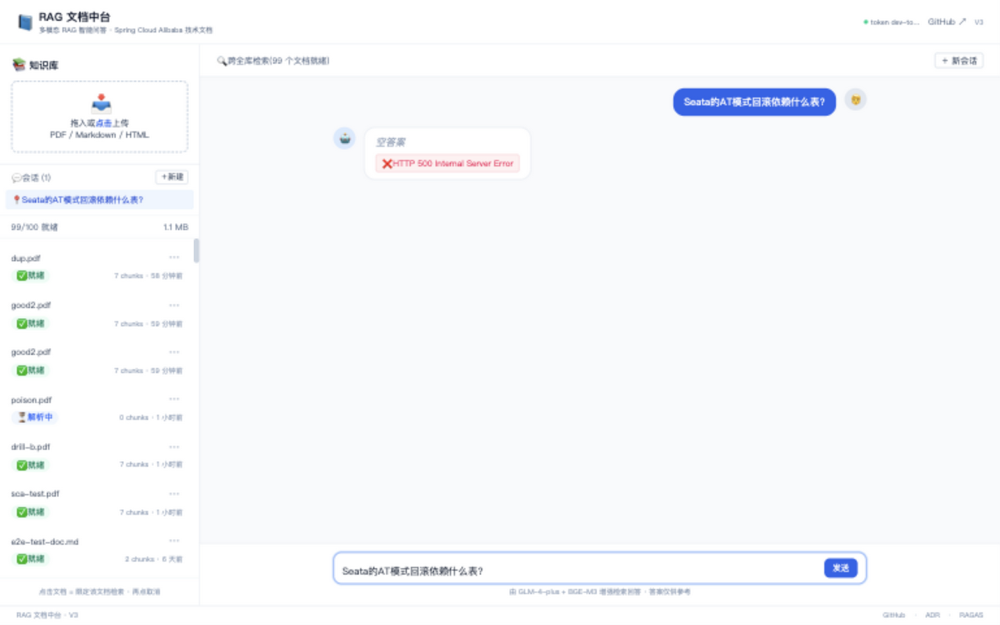
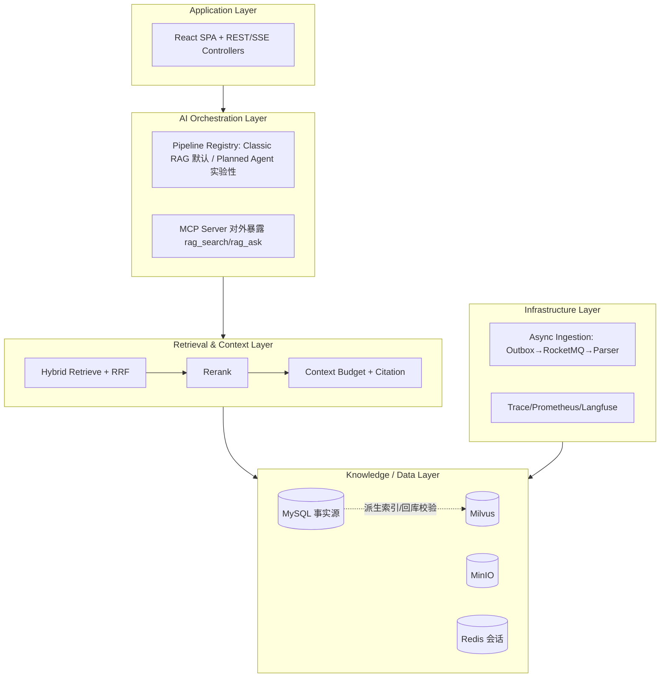
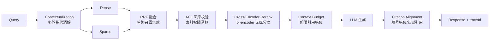
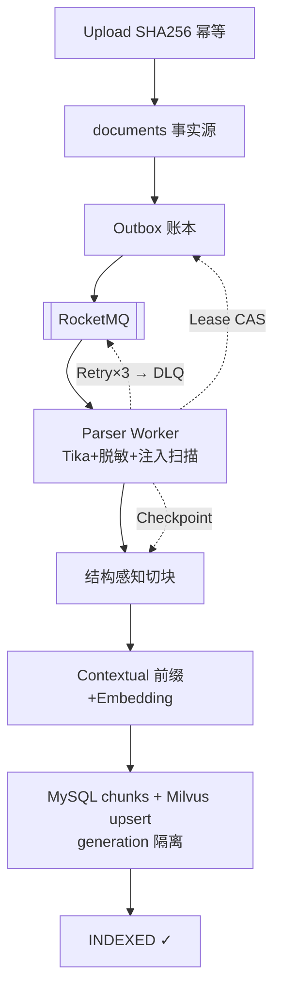
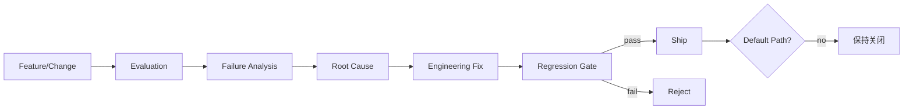

# 🥝 KiwiRAG

**Reliable RAG Infrastructure for Knowledge Applications**

KiwiRAG（仓库 `rag-doc-platform`）是一个面向知识密集型 AI 应用的 production-oriented RAG 平台：
覆盖可靠知识接入（Durable Ingestion）、Hybrid Retrieval、Context Engineering、可信引用生成
（Grounded Generation）与系统化评测（Evaluation Harness），并通过可重复实验决定每个能力
是否进入默认执行路径——包括**否决更复杂的 Agentic 路径**。

> **核心原则：更复杂的 AI Pipeline 只有在端到端评测中带来可验证收益，才进入默认执行路径。**

    

**Highlights（每个都解决一个真实的 prototype→production 失败模式）：**

- 🔎 **Hybrid Retrieval** — Dense + Sparse 单路召回在术语/配置键查询上失效 → RRF 融合 + Cross-Encoder 精排（消融实测 faithfulness **+9.2pp**）
- 🛡 **Reliable Ingestion** — 同步解析在长文档/进程崩溃/重复投递下丢数据或阻塞 → Outbox + MQ + Lease + Retry + Checkpoint + DLQ（真实故障注入三测全 PASS）
- 🧠 **Context Engineering** — 上下文超预算后引用错位、历史挤占证据 → 查询改写 + 双闸门预算装填 + 异步历史压缩 + 截断引用同步对齐
- 📚 **Grounded Generation** — 幻觉引用与编号错位 → 引用对齐默认全链生效 + citation verification（可选开关）
- 📊 **Evaluation Harness** — "看起来更好"不等于更好 → 四层评测 + 回归门禁 + 配对 A/B + 逐样本 planner 隔离 + bootstrap CI

[Why](#why-kiwirag) · [Architecture](#system-architecture) · [Evaluation](#evaluation-driven-engineering) · [Validated Results](#validated-results) · [Quick Start](#quick-start) · [Limitations](#current-limitations)

---

## Why KiwiRAG?

普通 RAG Demo 与可靠 AI 知识系统之间隔着一系列真实的工程失败模式。KiwiRAG 解决的是这些问题：

| 普通 RAG Demo | KiwiRAG |
| --- | --- |
| Vector Top-K 单路召回 | Dense + Sparse + RRF + Cross-Encoder Rerank |
| 同步文档处理，崩溃即丢 | Durable Async Ingestion（Outbox/Lease/Checkpoint/DLQ） |
| 检索结果直接拼 Prompt | Context Selection + Token Budget + 引用对齐 |
| 引用只是文本编号 | Citation Alignment + 可选 Verification |
| 人工看几个 case 判断效果 | 四层评测 + CI 回归门禁 + 配对 A/B |
| Agent 越复杂越好 | Classic / Agentic 用实验选择（当前默认 Classic） |

## Demo / Screenshots

真实运行截图（无 placeholder，均为本地实际部署采集）：

| Knowledge Management | Chat 错误处理 | API 审计面 |
| :---: | :---: | :---: |
|  |  |  |

- **Knowledge Management**：左侧文档列表（含上传/解析中/已索引状态徽章），100 文档 Sidebar，
  顶部 token 管理器与 GitHub 链接
- **Chat Error State**：后端 500 时前端的优雅降级——用户看到明确的错误横幅而非静默失败
  （这是刻意展示的错误路径截图，正常回答路径见下方 API 证据）
- **API Audit**：OpenAPI 3.0 Swagger 界面——`GET /api/v1/agent/runs/{runId}` 端点提供
  Agent 执行的完整审计追踪（steps / status / decision_summary）

**已知前端限制**（如实标注）：SSE 流式对话在服务端 500 后偶发前端状态锁死，
需刷新页面恢复（backend SSE 端点经 curl 直验正常）。详见
[chat 锁死 issue](docs/audits/PRE_MERGE_DIFF_AUDIT.md)。

---

## System Architecture

五层结构（真实模块映射，无虚构组件；逐层细节见
[architecture-diagrams.md](docs/architecture/architecture-diagrams.md)）：



关键架构决策：**MySQL 为事实源、Milvus 为派生索引**（召回后逐条回库校验租户/软删/generation，
防索引与权限漂移）；DDD 六边形分层，application 层只依赖 port。

## Online RAG Pipeline

每个阶段的存在理由都是被评测暴露过的一个失败模式：



## Reliable Knowledge Ingestion

**为什么文档接入不能只是一次同步 HTTP 请求？** 长任务超时、worker 崩溃留下半成品、
消息重复投递造成双份索引、DB 与向量库部分失败不一致——同步路径在这些场景下必然出错。



**这不是纸面设计**——三项真实故障注入验证全 PASS
（[FAULT_INJECTION_REPORT](docs/reliability/FAULT_INJECTION_REPORT.md)）：
kill -9 worker 后零丢失零重复续点完成；毒消息 3 次重试进 DLQ 且不阻塞正常任务；
并发重复投递幂等收敛为单一文档。

## Retrieval & Context Engineering

**Retrieval**：Dense(BGE-M3) + Sparse(BM25) + RRF + Cross-Encoder(bge-reranker-v2-m3, GPU) + Score Gate + ACL。

**Context**：查询改写 / 会话历史压缩 / 上下文选择与预算 / 来源隔离标签（防 prompt 注入）。

关键消融（100 题，其余配置不变，[证据](docs/evaluation/CLAIM_EVIDENCE_MATRIX.md)）：

```text
Rerank OFF → ON:  faithfulness +9.2pp · recall +7.5pp
bi-encoder 召回分数几乎无区分度(top1 hybrid 0.028 vs 精排后 0.98) — 重排不是可选项
```

## Grounded Generation & Citation

```text
Retrieved Knowledge → Context Assembly → Generation → Citation Mapping
→ Citation Verification(可选) → Final Answer
```

解决：幻觉引用（引用必须锚定真实 chunk）、截断后编号错位（预算器与 citations 同步裁剪）、
不可追溯（每条回答携带 traceId → run/step 审计链）。

## Evaluation-Driven Engineering

评测驱动不是"做完功能跑一次 RAGAS"，而是**能力进入默认路径前必须通过预定义 evaluation gate**：



四层评测：检索侧（Recall@K/MRR/NDCG）· 生成侧（RAGAS）· 拒答分离（诚实拒答≠幻觉）·
Agentic 对照（配对 A/B + 盲评换位 + bootstrap CI + 逐样本 planner 隔离 + validity gate）。
回归门禁：主分支 nightly 评测，任一指标降幅 >3pp 自动阻断并开 issue。

### 三个代表性 Engineering Stories

**Case 1 — Retrieval（评测否决直觉）**：rerank 消融测出 +9.2pp 才开启重排；同法发现
"评测配置与线上漂移"导致拒答率虚高 16%→修复后 6%——先修尺子再修系统。

**Case 2 — Reliability（故障注入验证架构）**：索引链路曾因 embed 并发风暴 4 小时跑不完
（超时→熔断误判→重投风暴→DLQ，三层根因修复后 6 分钟零失败）；kill-9/毒消息/重复投递注入三测全 PASS。

**Case 3 — Agentic RAG（用实验否决自己的复杂度）**：完整实现 bounded Plan-Execute-Replan
后发现 Classic 仍更优——没有删代码，而是让数据决定默认路径（下节）。

## Agentic RAG: When More Agency Is Not Better

完整实现的实验性执行策略（**默认关闭**）：

```text
Planner → Tool Execution → Semantic Sufficiency → Replan(bounded) → Composer / Abstain / Fallback
```

修复三个机制缺陷（replan 命名空间冲突 / replan 不可见已试查询 / 规则判定器构造性
false-sufficient）后，与 Classic 的配对差距从 **-8.3pp（显著）收敛到 -0.2pp（统计平手）**，
多跳 slice 首次名义反超（+2.3pp, n.s.）——但代价是 **×2.8 延迟、3.4 次 LLM 调用/run**。

> **Agentic path remains disabled by default.** 更复杂的 Agent 不自动意味着更高质量：
> 在当前任务分布下，额外 planning/tool/replan 的收益不足以覆盖延迟与成本。
> 启用边界的完整数据分析见 [WHEN_TO_USE_AGENTIC_RAG](docs/agentic/WHEN_TO_USE_AGENTIC_RAG.md)。

## Validated Results

**Current Frozen Results**（common-cohort 46 题，单 run 配对 + bootstrap 95%CI，
[完整口径](docs/evaluation/2026-08-27-postd3-residual-audit.md)）：

| System | Overall vs Classic | Multi-hop | Latency |
| --- | ---: | ---: | ---: |
| Classic RAG（基线） | baseline | baseline | 1.0× |
| Pre-fix Agentic | **-8.3pp** \* | -10.0pp \* | ~2.7× |
| Post-fix Agentic | -0.2pp (n.s.) | +2.3pp (n.s.) | ~2.8× |

\* 95% CI 不含 0；修复效应 Post−Pre = +5.7pp \*（CI [+0.9, +11.7]）。

其他冻结指标：Classic faithfulness **0.885** / recall **0.90**（80 题冻结集，单 run）；
语义充分性判定 human agreement 42%→**96%**（24 对独立 holdout）；
性能基准（单机 dev, rerank OFF）E2E P50 **1029ms** / LLM TTFT P50 **688ms**
（[perf/performance_report.md](perf/performance_report.md)，c=1；c=10 与限制口径见报告）。

**Historical Milestones**（过程数字，非当前 headline）：见
[docs/evaluation/](docs/evaluation/) 报告链与 [Claim→Evidence 矩阵](docs/evaluation/CLAIM_EVIDENCE_MATRIX.md)。

## Quick Start

```bash
# Prerequisites: JDK 17, Docker 24+(compose v2)
make env                      # 1. 配置: .env.example → .env (填 LLM_API_KEY, 不提交 secret)
make up && make ps            # 2. 中间件: MySQL/Redis/MinIO/Milvus/RocketMQ
make run                      # 3. 后端: http://localhost:8080
make test                     # 4. 测试: 单测 + ArchUnit

cd frontend && npm install && npm run dev   # 5. 前端(可选): :5173 代理到 8080
```

检索模式（真实配置）：

```text
Minimal(无 GPU): RAG_RERANK_ENABLED=false → hybrid 检索功能完整
Full:            GPU reranker + 隧道 18080 → docs/operations/autodl-reranker-sop.md
```

首个请求与 Agent run 审计：

```bash
curl -s localhost:8080/api/v1/chat -H "Authorization: Bearer $TOKEN" \
  -H "Content-Type: application/json" -d '{"query":"...","mode":"RAG","top_k":5}'
# Agentic 需显式开启(RAG_AGENT_PLANNER_ENABLED=true, 默认 false)
# 审计: GET /api/v1/agent/runs/$RUN_ID (X-Agent-Run-Id 响应头)
```

评测运行：`eval/` 各脚本 + `docs/operations/eval-regression-sop.md`（需 judge API key）。

## Current Limitations

如实列出（可信度的一部分，详细见 [FINAL_RELEASE_GATE](docs/audits/FINAL_RELEASE_GATE.md)）：

1. **CI 运行态未验证**——分支未合入 main（workflows 语法合法、fork skip policy 已确认）；
2. **性能基准口径有限**——单机 dev、rerank OFF、c≤10（rerank/高并发未测，GPU 外部依赖）；
3. **Agentic 默认关闭**——平手质量不抵 ×2.8 延迟；语义 replan 收益个体不显著（n=10）；
4. **真实用户流量验证缺失**——extractive GT 为 LLM 生成题集；
5. **前端 SSE 错误后状态锁死**（已录截图与 known issue，后端正常）；
6. **LLM Judge 人工校准有限**（judge 与人工一致 62-75%，已量化并双 judge 缓解）；
7. 解析为 **multi-format**（PDF/DOCX/PPT/TXT），非 multimodal。

## Deep Dive Documentation

| 主题 | 入口 |
| --- | --- |
| 五张核心架构图 | [docs/architecture/architecture-diagrams.md](docs/architecture/architecture-diagrams.md) |
| 评测方法与全部冻结报告 | [docs/evaluation/](docs/evaluation/)（含 [Claim→Evidence 矩阵](docs/evaluation/CLAIM_EVIDENCE_MATRIX.md)） |
| 故障注入验证 | [docs/reliability/FAULT_INJECTION_REPORT.md](docs/reliability/FAULT_INJECTION_REPORT.md) |
| 何时用 Agentic（数据依据） | [docs/agentic/WHEN_TO_USE_AGENTIC_RAG.md](docs/agentic/WHEN_TO_USE_AGENTIC_RAG.md) |
| 性能基准 | [perf/performance_report.md](perf/performance_report.md) |
| ADR ×15 / 运维 runbook | [docs/adr/](docs/adr/) · [docs/operations/](docs/operations/) |
| 前端 | [frontend/README.md](frontend/README.md) |
