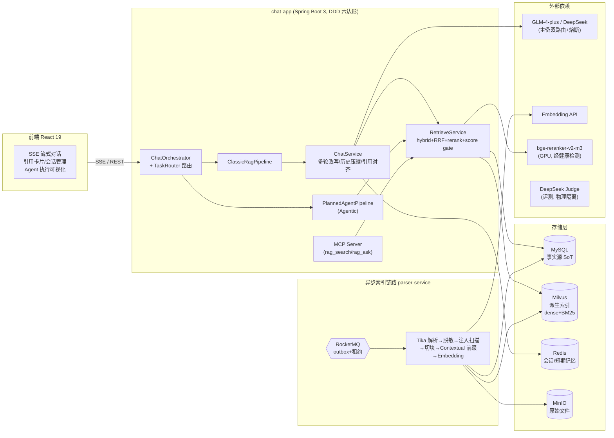
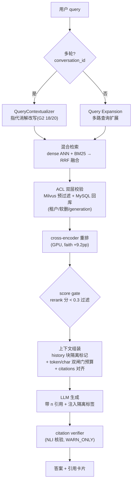
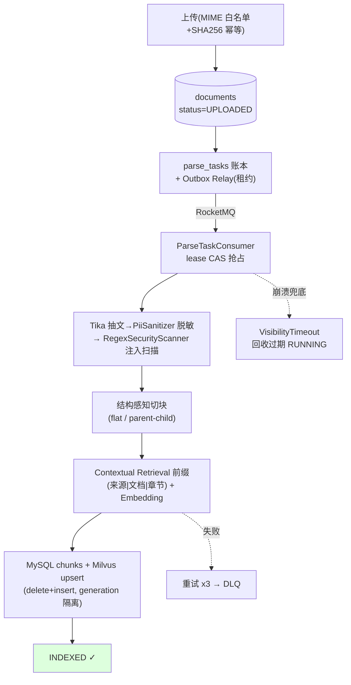
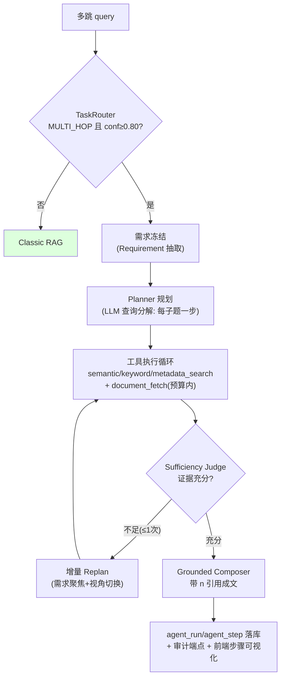

# rag-doc-platform (kiwi-doc)

> 企业级 RAG 文档问答平台。**核心方法论: 评测驱动开发** —— 每个能力先建评测、
> 由评测暴露问题、修复后复测闭环；Classic RAG 已在 80 题冻结集与 G1-G5 门禁上形成可复现基线。

## 项目一句话

Java/Kotlin 多模块(Spring Boot 3 + DDD 六边形)的私有知识库问答系统:
混合检索(dense+BM25 RRF) → cross-encoder 重排 → Contextual Retrieval 前缀 →
引用可溯源生成; 多轮对话(SSE 贯通 + 异步历史压缩); Agentic RAG 路径
(Plan-Execute + Sufficiency Judge + 预算/检查点)已通电并完成对照评测;
平台能力经 MCP Server 对外暴露; 四层评测体系全程守护。

## 评测驱动的修复闭环(本项目的主线叙事)

不是"功能清单"驱动, 是"评测暴露 → 根因定位 → 修复 → 复测"驱动。
每一条都有 commit 和评测报告可查(`docs/evaluation/`):

| 评测暴露的问题 | 根因 | 修复 | 复测结果 |
|---|---|---|---|
| rerank 对照全指标差 5-9pp | 本地 Rosetta 跑不动 reranker | 迁 GPU + 隧道 | faith +9.2pp / recall +7.5pp |
| 拒答率 16.25% | 评测配置与线上默认漂移 | hybrid 设默认 + contextual 前缀 | 拒答 4% |
| 引用编号错位 | history 块占 [1] + 截断后 citations 不对齐 | marker 隔离 + 双闸门预算器 | 引用一一对齐 |
| 多轮 gate 全 FAIL | SSE 丢 conversationId + 鹦鹉误杀 + 压缩丢写 | 三连修复 | G1 保持 PASS, G5 +14pp |
| 索引 4 小时跑不完 | embed 并发风暴→熔断→DLQ | 信号量 + CB 阈值 + 云 embed | 6 分钟零失败 |
| agentic 有证据仍拒答 63% | 判定器把"跨版本证据"误判为冲突终态 | 冲突语义修正 | 拒答 63%→18%, acc 11.7%→25% |

**Agentic RAG 的诚实结论**(docs/evaluation/2026-08-23-agentic-phase1-report.md):
当前语料(3074 chunks)+规则 Planner 下, agentic 未超 Classic 且延迟×5 ——
按预设"不达标出口"保持默认关闭。这正是"何时不需要 Agent"的实证, 与业界共识一致。

## 评测体系(四层)

检索侧(Recall@K/MRR/NDCG) · 生成侧(RAGAS 四件套) · **拒答分离**(自研: 把诚实拒答
与幻觉分开计量) · 多轮 gate(G1-G5) + agentic 对照(pass^k + 延迟/引用三维)。
judge 治理: 异族 DeepSeek 与业务 GLM 物理隔离, 基线证书(题集 SHA256+commit 锁定),
CI -3% 回归门禁, 曾自查出题集 100% 标注泄漏并判 FAIL。

### 当前冻结基线（2026-08-25）

检索使用 80 题 current-corpus 冻结集、3 次重复运行。旧 chunk-id 金标已因语料与索引漂移废止，
当前金标以可审计 evidence/content hash 锁定。

| 检索指标 | 当前值 | 重复运行标准差 | 逐题 95% CI |
|---|---:|---:|---:|
| Hit / Recall@5 | **92.50%** | 0 | 84.59%–96.52% |
| MRR@5 | **81.04%** | 0 | 73.44%–87.81% |
| NDCG@5 | **83.92%** | 0 | 77.30%–89.96% |
| Precision@5 | **19.00%** | 0 | 17.50%–20.25% |

生成质量（同一 80 题冻结集）: Answer Correctness **0.8753** · Faithfulness **0.9705** ·
Evidence Completeness **0.9230** · Citation Hit **1.0000** · Context Recall **0.9698**。
严格逐字引用 Precision 为 **0.3219**，反映答案常引用正确片段但未逐字复述，单独保留为诊断指标，
不与 citation hit 混报。

多轮严格聚合门禁: G1 **PASS(80)** · G2 **PASS(19/20)** · G3 **PASS(10/10)** ·
G4 **PASS(50/50，mean fidelity 0.995)** · G5 **PASS(50/50)**。所有 gate 的题集指纹一致；
G2 尚余 1 个语义范围偏宽样本，因此不声称样本级 100%。

Agentic 对照: Classic 36.7% vs Agentic 30.0%(五轮校准 11.7%→30%, 延迟×2.8)
—— 数据结论: 当前语料保持默认关闭。后续只在多文档比较、多约束排障、多步检索等复杂切片中
做同题 A/B；必须同时证明质量增益、成本可接受和可回退，才允许灰度启用。协议见
`docs/evaluation/agentic-incremental-value-protocol.md`，历史对照见
`docs/evaluation/2026-08-23-agentic-phase1-report.md`。
每个数字的完整出处(题集/协议/judge/原始文件): `docs/evaluation/evidence-provenance.md`。

## 架构图(Mermaid, GitHub 原生渲染)

### 系统总览



### 读路径: RAG 检索与生成



### 写路径: 异步索引链路(可靠性)



### Agentic 执行循环(对照评测后默认关闭, 详见报告)



## 架构要点

- **MySQL 为事实源, Milvus 为派生索引**(召回后逐条回库校验租户/软删/generation)
- **异步索引链路**: outbox → RocketMQ → parser-service, 租约 + visibility timeout + 对账, kill -9 演练验证
- **安全**: Deny-by-Default 认证 + 文档/块双层 ACL 守门 + prompt 注入双层防御(ingress 扫描 + 上下文隔离标签)
- **Agent 执行**: 六维预算(步数/工具/LLM/token/成本/时长) + CAS 状态机 + checkpoint + 只读审计端点
- **12 篇 ADR** 记录全部关键取舍(docs/adr/), 含 Agentic RAG 升级方案(ADR-0012)

> V3 spec / runbook / 验收报告见 `docs/v3/`; 评测报告见 `docs/evaluation/`;
> Agentic 调研见 `docs/research/`。

---

## 5 分钟启动

前置依赖:
- JDK 17 (V3 暂用 17,V4 接虚拟线程后切 21)
- Docker 24+ 与 Docker Compose v2
- (可选) GNU Make
- (V3-W3 后) Autodl GPU 服务器(BGE-M3 / Reranker) 或本地 docker 起同等容器

```bash
# 1. 准备本地环境变量
make env                      # 从 .env.example 复制 .env

# 2. 启动中间件(MySQL / Redis / MinIO / Milvus / RocketMQ / BGE-M3 / Reranker)
make up                       # 首次拉镜像约 8-12 分钟(BGE/Reranker 大)

# 3. 等待 Milvus + BGE 健康(约 1-3 分钟, BGE start_period 240s)
make ps

# 4. 启 chat-app(默认 sync 模式, 不依赖 RocketMQ+parser-service 也跑通)
make run

# 5. (V3-W1 起的 async 路径) 切 async + 启 parser-service
#    RAG_PARSER_MODE=async ./gradlew :platform-bootstrap:bootRun
#    ./gradlew :parser-service:bootJar
#    java -jar parser-service/build/libs/parser-service.jar --spring.profiles.active=dev --server.port=8093

# 6. (V3-W3 起) Langfuse trace 接入(可选)
#    docker run langfuse/langfuse:latest 或 docker compose langfuse 主仓 compose
#    export LANGFUSE_ENABLED=true LANGFUSE_PUBLIC_KEY=... LANGFUSE_SECRET_KEY=...
```

启动后:
- chat-app 健康检查: http://localhost:8080/actuator/health
- Swagger UI: http://localhost:8080/swagger-ui.html
- parser-service 健康检查(V3 async 时): http://localhost:8093/actuator/health
- MinIO 控制台: http://localhost:9001 (用户 `minio` / 密码 `minio123`)
- Langfuse 控制台(V3-W3, enabled 时): http://localhost:3000

### 前端 SPA(可选,V3 已落地)

```bash
cd frontend
npm install
npm run dev     # http://localhost:5173(被占用则自动落到 5174)
```

dev 模式下 `vite.config.ts` 把 `/api/*` 反向代理到 `http://localhost:8080`,
因此**不需要**在后端额外开 CORS。前置条件:chat-app 已 `make run` 起来。
打开浏览器即可:左侧上传/选择文档 → 右侧输入问题 → SSE 流式回答 → 引用卡片 → 👍/👎 反馈。
细节见 [`frontend/README.md`](frontend/README.md)。

---

## 项目结构

```
rag-doc-platform/
├── platform-common/             # 共享层(domain / port / chunking / 异常 / DTO / TraceObserver 端口)
├── platform-bootstrap/          # chat-app: Spring Boot 主模块
│   └── src/main/java/com/xxx/ragdoc/
│       ├── interfaces/rest/     # Controller / DTO / Filter / 异常处理
│       ├── application/         # 应用服务(DocumentUpload/Chat/Retrieve/Feedback)
│       ├── infrastructure/      # JPA / MinIO / Milvus / DashScope / Tika / MQ producer / Langfuse trace
│       └── event/               # 领域事件发布
├── parser-service/              # V3-W1 独立异步解析服务(RocketMQ 驱动, 已落地 DoD-1/2/4)
│   └── src/main/java/com/xxx/ragdoc/parser/
│       ├── application/         # ParseTaskService(状态机) / ParseWorker(Tika+checkpoint)
│       └── infrastructure/      # ParseTaskConsumer(RocketMQListener) / Visibility Timeout Scheduler
├── frontend/                    # V3 前端 SPA(React 19 + Vite 8 + Tailwind v4 + Zustand 5)
│   ├── src/
│   │   ├── api/                 # client/documents/chat(SSE)/chunks/feedback
│   │   ├── components/          # Sidebar/ChatWindow/ChatMessage/CitationCard/FeedbackBar
│   │   │                        # + StateBanner/StatusBadge/UploadDropzone/Toaster
│   │   │                        # + TokenEditor/ErrorBoundary
│   │   ├── store/               # useDocStore / useChatStore(persist) / useToastStore / useUIStore
│   │   └── types/api.ts         # 与后端 DTO 对齐的 TS 类型
│   ├── Dockerfile               # 多阶段构建(node:20 build → nginx:alpine serve)
│   ├── vitest.config.ts         # jsdom + globals, 与 vite.config.ts 分离
│   └── nginx 反代规则见 ../deploy/nginx.conf
├── deploy/
│   ├── docker-compose.yml       # 本地中间件 + RocketMQ broker 一键起(含 frontend profile)
│   └── nginx.conf               # prod 部署: 静态托管 + SSE buffer off + 安全头 + /healthz
├── docs/adr/                    # 架构决策记录(ADR-0001 ~ 0010)
├── docs/v3/                     # V3 spec / kill-9 runbook / 验收报告 / P0 runbook(待加)
├── docs/operations/             # Autodl reranker SOP / eval-regression SOP
├── eval/                        # RAGAS 评测脚本 + 真实 baseline 报告(ADR-0008)
├── scripts/                     # 工具脚本 + v3-kill-9-drill.sh
├── .github/workflows/           # CI(Java lint+test) + frontend-ci(vitest+tsc+build) + eval-regression
├── Makefile                     # 常用命令封装
└── .env.example                 # 本地配置模板
```

---

## 实现进度(V3 主验收门槛已命中 ✨, 2026-08-02)

### RAG 质量真值(P0 run final)

✨ **V3 验收门槛已命中**: faith 0.88 / precision 0.87 / recall 0.90 远超设计目标(faith ≥0.75 / recall ≥0.65)。

详见 [eval/baseline_v3_judge_plus.md](eval/baseline_v3_judge_plus.md) + [docs/v3/v3-acceptance-report.md §4](docs/v3/v3-acceptance-report.md)。

### 已落地能力

| 能力 | 状态 | 说明 |
|---|---|---|
| 上传 `POST /api/v1/documents` | ✅ | SHA256 幂等 + 类型/大小白名单 + MinIO 落盘 |
| 解析索引(同步 sync 模式) | ✅ | Tika + Parent-Child 切片 + BGE-M3 embed + Milvus + 状态机 |
| 解析索引(异步 async 模式) | ✅ **V3-W1** | MQ producer + parser-service consumer + chunk-level 续点 |
| Chunk 切片 | ✅ | flat / parent_child 双模式 + Markdown 结构感知 + child overlap |
| 向量检索 | ✅ | Milvus hybrid(dense BGE-M3 + sparse BM25) + RRF 融合 + 业务元数据过滤 |
| Reranker | ✅ | bge-reranker-v2-m3(Autodl 部署, SOP 见 docs/operations) |
| Chat | ✅ | 4 档降级(EMPTY_KB/NO_RECALL/LLM_DEGRADED/OK) + trace_id 贯穿 |
| Chat SSE 流式 | ✅ | Flux<ChatStreamEvent> 首token <1.5s |
| Feedback + trace | ✅ | feedbacks 软引用 chat_traces.trace_id(ADR-0003) |
| parser-service kill -9 故障韧性 | ✅ **V3-W1** | 心跳 job + 续点 + 演练脚本(实跑 log 待 mac 窗口) |
| Langfuse trace 接入(同步 chat 路径) | ✅ **V3-W3** | No-op 兜底 + HTTP ingestion client, enabled=false 零开销 |
| RAGAS CI 门禁(nightly + label-gate) | ✅ **V3-W3** | ADR-0008 D3 落地, PR 带 eval-impact label 触发, regression 自动开 issue |

### 未做 / 推后项(诚实标注)

| 项 | 推到哪 | 原因 |
|---|---|---|
| Langfuse SSE(chatStream) 路径接入 | V3.5 / V4 | Flux 流式 token 完成 endTrace 设计复杂度高于同步 |
| DoD-2 端到端集成测试(poison msg → DLQ) | V3.5 | 单测覆盖了状态机, 端到端 IT 推后 |
| kill -9 演练实跑 PASS log | mac/Autodl 窗口 | 跑 5-10min 出截图入验收报告(不阻塞 Accepted) |
| noise 校准(nightly 跑 ≥3 次 mean ± std) | V3 末 nightly | 当前 baseline 单跑, threshold 临时 5pp buffer |
| corpus 扩到 500+ docs | V4 | V3 已跨过验收门槛, 大 corpus 是 V4 RAG 调优主线 |
| 真实用户 query 流量校准 | V4 | extractive GT 是 LLM 生成题, 真实 query 才是真验收 |
| docker-compose Locust 100 并发压测 | V4 + 真流量 | ADR-0010 砍掉, 0 用户场景演不出 HP 价值 |
| k3s / K8s | V4 + 真流量 | ADR-0007 Superseded, 同上 |

V3 范围与砍项理由详见 `docs/adr/adr-0010-v3-rebalance-cut-rag-llm-k8s.md`。
V3 真实完成度 / 进 V4 启动门槛判据见 `docs/v3/v3-acceptance-report.md`。

---

## V3 DoD 验收对照(spec §9)

| DoD | 状态 | 验证 |
|---|---|---|
| **DoD-1** kill -9 优雅降级 | ✅ 代码 | `scripts/v3-kill-9-drill.sh` + runbook; 🟡 实跑 PASS log 待 |
| **DoD-2** 重试续解析 + DLQ | 🟡 单测 cover 状态机 | 端到端 IT 推 V3-W3 末 |
| **DoD-3** p95 < 2s | ❌ | Locust 100 推 V4(0 用户场景演不出) |
| **DoD-4** 中断续点 | ✅ 代码 | `ParseWorker.checkpointProgress` 每 10 chunks flush; 🟡 实跑 PASS log 待 |
| **DoD-5** trace(Langfuse) | 🟡 同步路径接入 | SSE 路径 + ChatStreamEvent 五点接入推 V3-W3 末 |
| **DoD-6** 灰度降级(sync↔async) | ✅ 代码 | `@ConditionalOnProperty` + DocumentUploadService 端口零改动 |

---

## 常用命令

```bash
make help           # 列所有目标
make up             # 起中间件(含 RocketMQ)
make down           # 停中间件
make run            # 启动 chat-app(默认 sync)
make test           # 跑单测 + ArchUnit
make lint           # Spotless 格式检查
make app            # 打 jar

# 异步路径启动(V3-W1)
RAG_PARSER_MODE=async ./gradlew :platform-bootstrap:bootRun
./gradlew :parser-service:bootJar && java -jar parser-service/build/libs/parser-service.jar

# V3-W1 DoD 演练
./scripts/v3-kill-9-drill.sh
```

---

## 资源画像(最低)

| 组件 | 内存 | 磁盘 |
|---|---|---|
| chat-app + 中间件 + RocketMQ | 5GB | 35GB |
| + Autodl Reranker / BGE | 需独立 GPU(≥ 16GB 显存) | - |
| + Langfuse(自部署) | + 0.5GB | + 1GB |

---

## 评价与数据(诚实)

详见 `eval/` 目录, 这里只放对外 baseline:

| 配置 | faith | precision | recall | 备注 |
|---|---|---|---|---|
| **V3 P0 run final ✨ (100 docs, 30 题 extractive GT, rerank ON)** | **0.8849** | **0.8661** | **0.9000** | `glm-4-plus` judge, 跨过 V3 合格线 |
| V3 P0 run1 (100 docs, 80 题, rerank OFF, 改写 GT) | 0.6072 | 0.4968 | 0.3486 | 历史过程数字, 跑前配置错(rerank OFF + GT 模板污染) |
| V2-P4 +reranker (50 docs, flat) | 0.6711 | 0.7193 | 0.5711 | `glm-4-flash` judge, 与 P0 +plus judge 不可直比 |

**V3 验收门槛 已命中**: ADR-0008 设计目标 faith ≥0.75 / recall ≥0.65, P0 run final **远超**(faith +13.5pp / recall +25pp)。

corpus 完整性是 RAG 数字最大杠杆: 50 docs → 100 docs 后 recall +23pp; reranker ON 净增 ≈ +50pp across metrics(V3-W3 extractive GT 让增益更显性)。
**V4 主线候选**: 真实用户 query 流量校准 + HyDE / query rewrite 二阶优化 + corpus 扩 500+。

---

## CI / 评测门禁

| Workflow | 触发 | 用途 |
|---|---|---|
| `.github/workflows/ci.yml` | 每个 PR / push | spotless + test + ArchUnit 守护 |
| `.github/workflows/frontend-ci.yml` | 每个 PR / push (frontend/**) | npm ci + **vitest + tsc + vite build**, ~40s |
| `.github/workflows/eval-regression.yml` | nightly + PR 带 `eval-impact` label + 手动 | RAGAS 30 题评测 + baseline 对比, regression 自动开 issue |

eval-regression 详见 `docs/operations/eval-regression-sop.md`。

**必须打 `eval-impact` label 的 PR**: 改切片 / 检索 / embedding / corpus / reranker / prompt。

---

## 前端 SPA (V3 已落地)

V3 第二交付主线 — 把 chat-app 的 REST + SSE 后端能力翻译成产品级浏览器体验。
脚手架→主链路→反馈闭环→bug 修复→prod 部署套件→引用卡片升级→测试基础设施, 8 个 commit 全在 `frontend/` 下。

### 技术栈 + 选型理由

| 关注点 | 选型 | 选型理由(不是盲目跟风) |
|---|---|---|
| 构建 | Vite 8 | dev proxy 反代 8080, 避开 CORS 这个永远坑的关口 |
| UI | React 19 + TypeScript 6 + Tailwind v4 | 函数组件 + 类型契约 + utility classes, 不引 UI kit |
| 状态 | Zustand 5 | 比 Redux 模板代码少 80%, 比 Context 不触发全树重渲染 |
| 路由 | ❌ 无 | 一个问答框 + 一个列表不需要 router |
| SSE | fetch + ReadableStream (非 EventSource) | 后端 chat/sse 是 POST+JSON body, EventSource 只支持 GET |
| Markdown | react-markdown 9 + remark-gfm | lazy import 拆 bundle, 首屏不必加载 |

### 已落地能力(对应后端契约)

| 模块 | 后端 | 前端 | 价值 |
|---|---|---|---|
| 文档列表 + 状态轮询 | `GET /documents` | Sidebar + DocItem | PARSING/UPLOADED 5s poll, 5min 上限 |
| 上传 | `POST /documents` (multipart) | UploadDropzone (拖拽 + 串行) | 防 embed 单线程被并发打爆 |
| 删除 / 重解析 | `DELETE /{id}` / `POST /{id}/retry` | Sidebar 操作菜单 ⋯ | 解决 FAILED 假死场景 |
| SSE 流式问答 | `POST /chat/sse` | fetch ReadableStream + 单帧 30s 看门狗 | 流式 token + abort 后恢复 |
| 引用卡片(主) | (SSE citations, 含 chunkId) | CitationCard | markdown 答案下方 [1][2] 对齐 |
| 引用源出处(PM-F1) | `GET /chunks/{id}` | 同组件并发拉 document_filename | 不再"文档 #97 是什么看不懂" |
| 引用上下文(ARCH-F5) | `GET /chunks/{id}/neighbors` | 同时拉 prev/next 嵌展开区 | LLM 用的 chunks 让用户前后扫一眼 |
| 反馈 | `POST /feedback` (rating=like/dislike) | FeedbackBar | NO_RECALL/LLM_DEGRADED 也能反馈 |
| 4 级降级提示 | SSE done.state_hint | StateBanner | EMPTY_KB/NO_RECALL/LLM_DEGRADED 友好文案 + trace_id |
| token 编辑 | Authorization header | TokenEditor | localStorage 持久 + 状态点(绿=默认/黄=自定义) |

### 生产部署套件 (prod 必修)

```
deploy/nginx.conf                # 静态托管 + 反代 chat-app:8080
frontend/Dockerfile              # 多阶段: node:20-alpine build → nginx:alpine serve
deploy/docker-compose.yml        # 加 frontend service (profile=gated, prod 烟测触发)
.github/workflows/frontend-ci.yml # PR 守门: vitest + tsc + vite build
```

**关键坑(不修上线 SSE 必坏)**: `location = /api/v1/chat/sse` 必须显式
```nginx
proxy_buffering        off;
proxy_cache            off;
chunked_transfer_encoding on;
gzip                   off;
proxy_read_timeout     300s;
```
否则 nginx 默认 buffering 把流式变批量, 体验直接死。

### 工程质量护栏

- **类型**: 全 DTO 手写 (`types/api.ts`), Jackson SNAKE_CASE 与 SSE record 原名双兼容
- **单测**: vitest 27 cases, SSE 帧解析(4 事件 × 双命名 × 4 类畸形帧) + formatBytes 边界 + formatRelativeTime + uid
- **CI 守门**: PR 必跑 vitest, 退出码非 0 即 fail
- **韧性**: 全局 ErrorBoundary 防白屏, SSE 30s 单帧 abort, persist rehydrate 兜底孤儿 streaming
- **bundle**: ChatMessage lazy 拆 159KB(48KB gzip), 首屏 main 仅 70KB gzip
- **a11y**: ⋯ 菜单走 role=menu/menuitem + aria-haspopup, 不再用 button-in-button 非法嵌套

### start / 测试

```bash
cd frontend
npm install
npm run dev        # http://localhost:5173(被占则自动 5174), 依赖本地 8080 chat-app
npm run test       # vitest 单测 (CI 用)
npm run test:watch # 监听模式
npm run build      # dist/ 产物, ~70KB gzip main + 48KB lazy ChatMessage
```

详见 [`frontend/README.md`](frontend/README.md)。

---

## 设计文档导航

```
../企业私有多模态RAG智能中台-设计文档/       # 原始设计(架构 / 数据 / 13 维度框架)
docs/adr/                                    # ADR-0001 ~ 0010 (含 Superseded 决策, 供回溯)
docs/v3/                                     # V3 spec(parser-service-spec.md) / kill-9 runbook / V3 验收报告
docs/operations/                             # Autodl reranker SOP / eval-regression SOP
eval/                                        # RAGAS 评测脚本 + baseline 报告
scripts/v3-kill-9-drill.sh                   # V3-W1 DoD-1 硬资产演练
.github/workflows/                           # CI + eval-regression(ADR-0008 D3)
```
