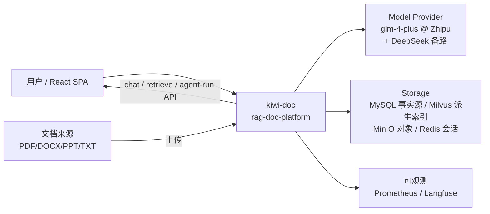
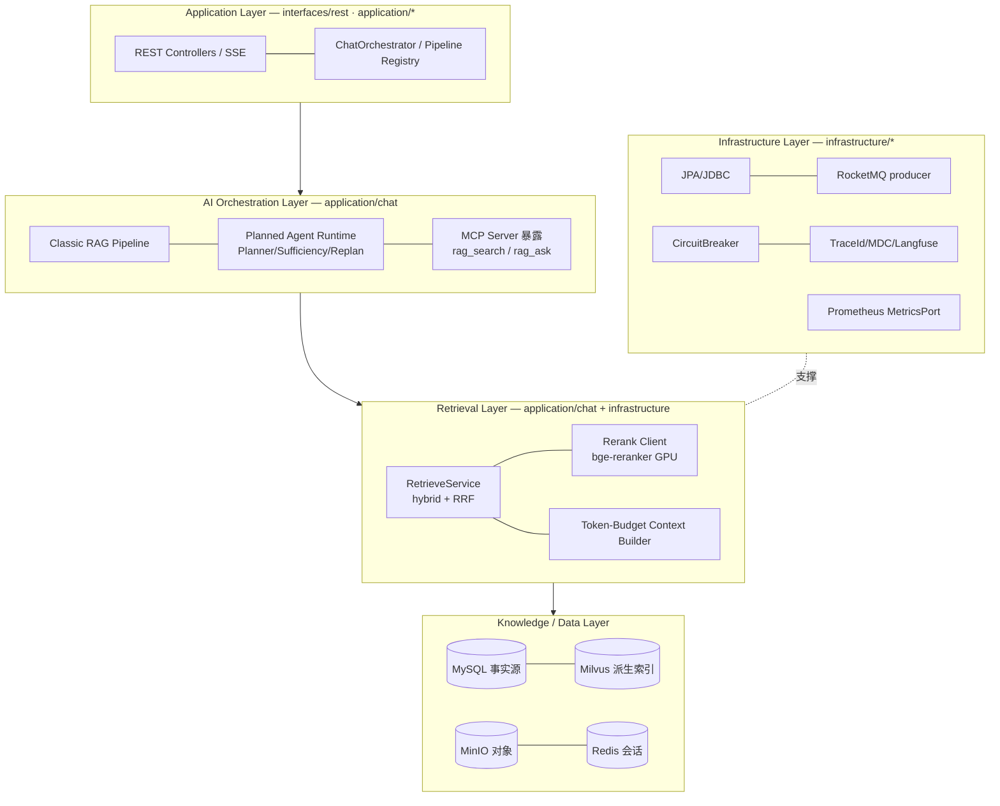
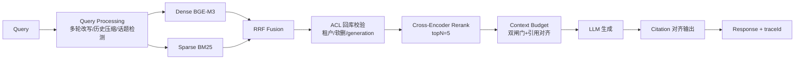

# Architecture Diagrams — 五张核心架构图 (Phase 6)

> 2026-08-29 · 全部图基于真实代码结构绘制（模块名/数据流可在 `platform-bootstrap`/
> `parser-service` 源码中逐一定位），无虚构模块。

## 1. System Context Diagram

只回答外部边界：谁用系统、系统依赖谁。



## 2. Layered Architecture

DDD 六边形四层（真实模块映射）：



## 3. Online RAG Serving Flow

在线检索-生成主链（Classic 默认路径；ACL=回库校验，非 Milvus 内过滤完即止）：



## 4. Durable Ingestion Flow

异步索引链路（Phase 5 故障注入验证过的可靠机制全部标注）：

```mermaid
flowchart TB
    U[Upload] --> DB[("documents<br/>SHA256 幂等")]
    DB --> OB[Outbox 账本<br/>parse_tasks]
    OB -->|Relay| MQ[[RocketMQ]]
    MQ --> PS[parser-service]
    PS --> TK[Tika 抽取+脱敏+注入扫描]
    TK --> CH[结构感知切块<br/>flat/parent-child]
    CH --> EM[Contextual 前缀+Embedding]
    EM --> IDX[MySQL chunks +<br/>Milvus upsert(generation 隔离)]
    IDX --> OK[INDEXED ✓]
    PS -.Lease CAS 抢占.-> OB
    PS -.Retry×3→DLQ.-> MQ
    PS -.Checkpoint 每10 chunks.-> CH
    OB -.Visibility Timeout 回收.-> MQ
    DB -.幂等键.-> U
```

（Lease / Retry / Checkpoint / DLQ / Idempotency 五机制经 `docs/reliability/FAULT_INJECTION_REPORT.md` 真实注入验证。）

## 5. Evaluation Architecture

评测体系四层与回归门禁（全部真实存在于 `eval/` 与 `.github/workflows/`）：

```mermaid
flowchart TB
    DS[冻结数据集<br/>SHA256+commit 锁定]
    DS --> R1[检索侧<br/>Recall@K/MRR/NDCG]
    DS --> R2[生成侧<br/>RAGAS 四件套]
    DS --> R3[拒答分离<br/>自研: 诚实拒答≠幻觉]
    DS --> R4[Agentic 对照<br/>paired A/B+盲评换位<br/>+planner_source 隔离<br/>+bootstrap CI]
    R1 & R2 & R3 --> G1[CI -3pp 回归门禁<br/>eval-regression workflow]
    R4 --> G2[Validity Gate<br/>MODEL样本<80%禁结论]
    G1 & G2 --> BASE[冻结基线证书<br/>eval/baseline_*.md]
```
