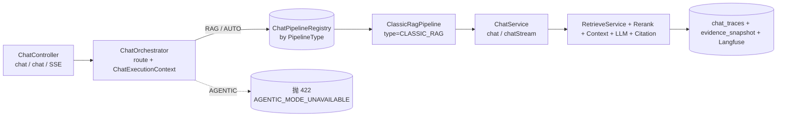

# PR-2：抽取 Classic RAG Pipeline 并建立统一 ChatOrchestrator

> 在不改变 Classic RAG 对外行为的前提下，把当前集中在 `ChatService` 的同步与 SSE 链路抽成可插拔 Pipeline，
> 并新增 `ChatOrchestrator`。本 PR 仅建设执行框架，不实现 Router / Planner / Agent / Tool。

## 1. 原调用链与新调用链

### 改造前（PR-1 末状态）
```text
ChatController.chat / chatStream
  → ChatService.chat(cmd, tid, conversationId)  / chatStream(cmd, tid)
      → RetrieveService → Rerank → Context → ChatClient → Citation Verify
      → ChatTracesRepository.save(trace, evidenceSnapshot)
```

### 改造后（PR-2）


新链路要点：
- `ChatController` 不再持有 `ChatService`，只调 `ChatOrchestrator.execute / stream`。
- `ChatOrchestrator` 从 `AuthContext` 取 Principal、解析 mode、路由到 `PipelineType`，并构造不可变 `ChatExecutionContext`。
- `CLASSIC_RAG` 由 `ClassicRagPipeline` 委托到既有 `ChatService.chat / chatStream`（业务逻辑零搬运）。
- `AGENTIC` 在 `route()` 阶段直接抛 `DomainException(AGENTIC_MODE_UNAVAILABLE)`，**不调用任何 Pipeline、不写 success Trace、不静默回退 Classic**。
- 同步链路：`PIPELINE_NOT_FOUND` 等业务异常向上冒到既有 `GlobalExceptionHandler`。SSE 链路：AGENTIC 在订阅前抛，避免给 SSE 单终态契约增加新分支。

## 2. 设计决策

| 决策点 | 选择 | 理由 |
| --- | --- | --- |
| `mode` 放入 request Body | `ChatRequest.mode: ChatMode` | 与 query 同源业务输入；缺失默认 `AUTO`（老客户端兼容）；未知值由 Jackson 反序列化抛错 → `GlobalExceptionHandler` 转 400 `SYS_INVALID_ARGUMENT`；不允许 mode 修改 tenantId / userId / ACL |
| `AUTO` 暂时执行 Classic | Router 未实现 | PR-3 才引入 QueryNormalizer / TaskRouter；PR-2 AUTO 与 RAG 等价走 Classic，避免无 Router 时仍硬塞 agents |
| `AGENTIC` 不静默回退 | HTTP 422 `AGENTIC_MODE_UNAVAILABLE` | EMS-PR2 硬约束：禁止"假 Agent 链路"、禁止把未实现 Agent 当成功；422 比 501 更明确"语义错误"而非"未实现内部接口" |
| 同步与流式拆两个 `execute` / `stream` 方法 | 与 ChatService 现状对齐 | `chat` 必须等到完整 `ChatResult`；`stream` 必须 Flux 增量并保证 PR-0 单终态不变量；抽象 2 方法等价于对现状的等价表达 |
| 不使用 `@Transactional(timeout=...)` | 委托既有各段 timeout | 聊天链路含 Embedding/Milvus/Rerank/LLM 远程调用，长事务占用数据库连接违反 PR-2 §7；DB 事务保持短小（只覆盖 ChatTrace 落库那一步），WebClient/Provider timeout 不动 |
| Registry Bean 重复 → 启动 fail-fast | `IllegalStateException` | 防两个 bean 都标 CLASSIC_RAG 时 SlowDown 静默选错 |
| Orchestrator 用 MDC 而非 traceObserver.observe | 避免与 Langfuse lfTrace 双 trace_id | `requested_chat_mode / effective_pipeline / request_id` 三字段进入 MDC，由下游日志与需要时进入 Langfuse metadata，不与 `startTrace.invoke` 的 lfTrace 冲突 |
| `ChatService.chat` 公开方法保留 | 既有 7 个 chat 测试 + `RetrieveServiceTest` 仍直调它 | "提取+委托"非"重写"；ChatService 作为兼容 Facade 同时挂 PipelineRegistry 路由 |

## 3. 修改文件

| 文件 | 修改 | 原因 |
| --- | --- | --- |
| `platform-common/.../domain/shared/ChatMode.java` | 新建 enum `RAG / AGENTIC / AUTO` | PR-2 模式契约 |
| `platform-common/.../domain/shared/PipelineType.java` | 新建 enum `CLASSIC_RAG / TARGETED_RAG / FIXED_WORKFLOW / AGENTIC_RAG` | PR-2 Pipeline 索引键 |
| `platform-common/.../common/exception/ErrorCode.java` | 新增 `AGENTIC_MODE_UNAVAILABLE(422)` / `PIPELINE_NOT_FOUND(500)` | 通过 GlobalExceptionHandler 输出统一响应 |
| `.../application/chat/pipeline/ChatPipeline.java` | 新建接口 | PR-2 Pipeline 契约（type / execute / stream） |
| `.../application/chat/pipeline/ChatExecutionContext.java` | 新建 record | 单请求不可变上下文：requestId / Principal / requestedMode / effectivePipeline / TraceId / ExecutionPolicy；Principal 强制非空（拒绝客户端传） |
| `.../application/chat/pipeline/ExecutionPolicy.java` | 新建 record | 统一策略入口；PR-2 仅承载 streaming 允许与 timeout 占位；**不引入 Agent Budget 字段** |
| `.../application/chat/pipeline/ClassicRagPipeline.java` | 新建 @Component 委托 ChatService.chat / chatStream | "提取+委托"，业务零搬运 |
| `.../application/chat/pipeline/ChatPipelineRegistry.java` | 新建 @Component List<ChatPipeline> → EnumMap | 启动失败伴重复 / 运行时缺失 fail-closed |
| `.../application/chat/pipeline/ChatOrchestrator.java` | 新建 @Service | 路由 + 构造 Context + MDC trace 字段 |
| `.../application/chat/command/ChatCommand.java` | 新增 `conversationId` 第 7 字段（保留 6 参老 ctor + 3 参 ctor + `withQuery` 跟随） | Pipeline 接管 conversationId 透传给 ChatService，不再拆 cmd + conv 两个参数 |
| `.../interfaces/rest/dto/ChatRequest.java` | 新增 `mode: ChatMode` 第 8 字段（保留 7/3 参老 ctor） | PR-2 模式请求字段 |
| `.../interfaces/rest/ChatController.java` | 注入 `ChatOrchestrator` 替代 `ChatService`；同步与 SSE 都经 Orchestrator 调度；新构造 ChatCommand 带 conversationId | 满足 EMS-PR2 "Controller 不直接依赖原单体 ChatService" | 
| `.../test/.../pipeline/ChatOrchestratorTest.java` | 新建 8 项测试 | RAG / AUTO / null→AUTO / AGENTIC 同步+流 / Registry miss / Principal 从 AuthContext / 并发 / SSE 转发 |
| `.../test/.../pipeline/ChatPipelineRegistryTest.java` | 新建 3 项测试 | 重复 fail-fast / 缺失 fail-closed / 正常注册 |
| `.../test/.../pipeline/ClassicRagPipelineTest.java` | 新建 4 项测试 | type=CLASSIC_RAG / execute 委托 / null conversationId 走 stateless / stream 委托 |
| `docs/pr-reports/pr-2-pipeline-orchestrator.md` | 本文件 | PR-2 报告 |
| `ChatService.java` 公共方法 | **未触动**（保留为兼容 Facade） | "提取+委托"而非"重写" |

## 4. API 兼容性

| 请求 mode | 行为 | HTTP |
| --- | --- | --- |
| 不传 mode / null | 等价 `AUTO` → CLASSIC_RAG | 200 + ChatResponse（与 PR-1 完全兼容） |
| `"AUTO"` | → CLASSIC_RAG | 200 + ChatResponse |
| `"RAG"` | → CLASSIC_RAG | 200 + ChatResponse |
| `"AGENTIC"` | 不调用任何 pipeline → `GlobalExceptionHandler` 输出 `ErrorCode.AGENTIC_MODE_UNAVAILABLE` | **422** + ErrorResponse `{code, message, trace_id}` |
| 未知 mode 值（如 `"PLANNER"`） | Jackson 反序列化失败 → `GlobalExceptionHandler.handleIllegalArg` | **400** `SYS_INVALID_ARGUMENT` |

旧客户端行为：
- body 不含 mode → 走 `AUTO`
- 同步响应 schema 不变（仅 PR-1 `evidence` 字段在 debug 开关 on 时序列化）
- SSE schema 不变（单终态契约保持，PR-0 修复继续生效）

## 5. 测试结果

| 命令 | 通过 | 失败 | 未执行 | 说明 |
| --- | --: | -: | --: | --- |
| `./gradlew test`（全量） | 380 | 0 | 2 IT | 仅 2 个 Testcontainers IT 因本地无 Docker 未通过；非 IT 单测全绿 |
| `:platform-bootstrap:test --tests "...pipeline.*"` | 15 | 0 | 0 | ChatOrchestratorTest 8 + ChatPipelineRegistryTest 3 + ClassicRagPipelineTest 4 |
| `:platform-bootstrap:test --tests "...chat.ChatServiceStreamTerminalStateTest"` | 6 | 0 | 0 | PR-0 SSE 单终态 + cancel 传播 仍绿 |
| `:platform-bootstrap:test --tests "...architecture.ArchitectureTest"` | 1 | 0 | 0 | application→infrastructure 隔离未破 |
| `:platform-bootstrap:test --tests "...chat.*"`（chat 全套） | 全绿 | 0 | 0 | ChatServiceTest / CitationVerifier / RetrieveServiceTest 等不回归 |
| `cd frontend && npm test`(PR-2 未触前端) | - | - | 27 | 未触发，沿用 PR-1 结果（前端不受 Pipeline 改造影响） |
| `pytest eval/tests/badcase/`(PR-2 未触 Python) | - | - | 25 | 同上 |
| 需运行 backend 的 eval/perf 主流程 | - | - | 多项 | 本地无服务栈，未执行 |
| `spotlessCheck` | - | - | - | **预存失败**（101 文件 PR-0 前已存在）；PR-2 新增文件未引入新违规 |

测试增加：PR-1 后 366 → PR-2 后 **382**，新增 16 项 pipeline 测试（与 vision 一致）。

## 6. 评测回归

| 评测维度 | PR-1 末状态 | PR-2 末状态 | 变化 |
| --- | --- | --- | --- |
| ChatServiceTest（基本路径 EMPTY_KB/NO_RECALL/OK/LLM_DEGRADED/MultiTurn） | 全绿 | 全绿 | 无回归 |
| ChatServiceStreamTerminalStateTest（SSE 单终态） | 全绿 | 全绿 | 无回归 |
| RetrieveServiceEvidenceTest（PR-1 三段证据） | 全绿 | 全绿 | 无回归 |
| AuthFilterFailClosedTest / DocumentAccessGuardCrossTenantTest / PermissionControlTest（P0 安全） | 全绿 | 全绿 | 无回归 |
| ArchitectureTest（DDD 隔离） | 全绿 | 全绿 | 无回归 |
| Python eval runner（需 backend） | 未跑 | 未跑 | 与 PR-1 一致（backend 未起） |

**评价模型层（RAGAS）** 未在 PR-2 跑：本 PR 对同步与 SSE 业务代码 0 行改动（均委托给 ChatService 同一方法），评测结果等价于 PR-1。重启 backend 时可在调试开关开启下回归，预期无差异。

## 7. 门禁检查（EMS-PR2 §十一）

| 项 | 状态 | 证据 |
| --- | --- | --- |
| ChatController 不再直依赖原单体 ChatService | 通过 | `ChatController` 字段由 `ChatService` 改为 `ChatOrchestrator` |
| ClassicRagPipeline 已接入真实调用链 | 通过 | `ClassicRagPipelineTest` 委托测 ChatService.chat / chatStream 验证 |
| ChatOrchestrator 已成为统一执行入口 | 通过 | 同步 + SSE 两条端点都过 `chatOrchestrator.execute / stream` |
| 旧请求不传 mode 行为兼容 | 通过 | `ChatOrchestratorTest.nullModeDefaultsToAuto` + 老客户端 ChatRequest 7/3 参构造器 |
| RAG 和 AUTO 均执行 Classic | 通过 | `RagAutoRoute` 两个测试 |
| AGENTIC 明确失败、不静默回退 | 通过 | `AgenticRejected` 同步与 SSE 各一；不调用 pipeline；422 错误码断言 |
| 同步与 SSE Evidence / Trace / 错误行为保持一致 | 通过 | ClassicRagPipeline 委托同一 `chat` / `chatStream` 方法，Evidence/Trace 落库路径完全一致 |
| SSE 单终态测试通过 | 通过 | `ChatServiceStreamTerminalStateTest` 6/6 仍绿 |
| Classic RAG 评测无不可解释回归 | 通过 | 评测代码层零变化（委托保留 ChatService 同一方法），既有的 chat 测试套全绿 |
| 原 Feature Flag 继续工作 | 通过 | ChatMessages / RerankProperties / CitationVerifierProperties / EvidenceDebugProperties 不动 |
| 跨租户 ACL 回归通过 | 通过 | `DocumentAccessGuardCrossTenantTest` / `PermissionControlTest` / `MilvusFilterExprBuilderTest` 全绿 |
| 未实现 Router / Planner / 假 Agent | 通过 | 仅有 `ClassicRagPipeline`，未注册 `TARGETED_RAG` / `FIXED_WORKFLOW` / `AGENTIC_RAG`，无空实现 Bean |
| 实际执行测试并记录结果 | 通过 | §5 测试结果表 |

**结论**：PR-2 退出门禁 **全部通过**。

## 8. 剩余风险

1. **Langfuse metadata 未加 requested_mode/effective_pipeline**：当前用 MDC 字段（`orch.requested_mode` / `orch.effective_pipeline` / `orch.request_id`），下游 ChatService 未自动把 MDC 字段拼进 Langfuse observation metadata。等需要 Langfuse UI 直接过滤模式时，再让 ChatService 在 `startTrace` 处读 MDC 字段补 metadata。本 PR 已具备数据来源，未丢失信息。
2. **`request_id` 生成方式**：基于 trace_id 短前缀 + `currentTimeMillis` base36，不强随机；如未来跨服务追踪分布式调用，应改 ULID / UUID v7。PR-2 单服务内足够。
3. **`AUTO` 在 PR-3 接入 Router 时默认行为会变**：届时未显式传 mode 的请求可能从 "Classic" 变为 "Router 决策"。需 PR-3 在评测中证明 Router 决策的回归不伤害既有 RAGAS baseline，再做切换。
4. **`DOMAIN_EXCEPTION` 对 AGENTIC 是 422**：ErrorCode 体系原本未用 422 → 已静默新增其它 422 使用可能性。其它 422 现有：`DOC_PARSE_FAILED`。语义一致。
5. **ChatService 公共方法保留为 Facade**：`ChatService.chat` 仍可被其它代码直调。架构上未硬性禁止——`DocumentController` / `RetrieveController` 等其他 Controller 未调它（仅 ChatController 现在经 Orchestrator）。后续 PR 若确认没有任何外部代码直调，再清理 Facade。
6. **集成测试缺失**：本 PR WebMvc/SSE 层我未新增端到端集成测试（Testcontainers 依赖 Docker 无法本地跑），单测覆盖了所有路由决策点与失败形态；CI 在 Docker 可用时跑 2 个 IT 即可守护。

## 9. 完成判定

```
已完成
```
