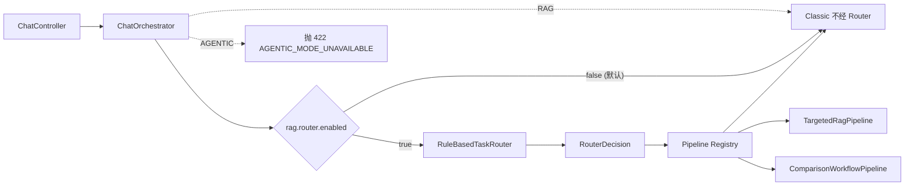

# PR-3 完成报告：Router + Targeted RAG + Comparison Workflow

> 在不破坏 Classic RAG 行为前提下，引入规则优先可解释 TaskRouter + 两条新 Pipeline。本 PR 把
> `AUTO` 模式从"等同 Classic"升级为"按问题类型路由到 Classic / Targeted RAG / Comparison Workflow"。
> Agentic RAG / Planner / Tool Contract 不在本 PR 范围。

## 1. 调用链



PR-3 完成后 Registry 自动注册三个 Pipeline bean；启用 Router 时 AUTO 路径真正按 strategy 派发。

## 2. 设计决策（PR-3 终极版）

| 决策 | 选择 | 理由 |
| --- | --- | --- |
| Router 一次决策，不 Replan | router.route(query) → RouterDecision | Replan 是 PR-7 Planner 阶段职责 |
| 规则优先于 LLM | RuleBasedTaskRouter 纯函数 | 企业系统第一版要可解释；评测可对每个 caseId 核对 reasonCode |
| COMPARISON 压 NUMERIC | 优先级 UNANSWERABLE > COMPARISON > MULTI_HOP > NUMERIC > ENTITY > SUMMARY > FACT | 任务 §2 锁定："比较即使含版本号也走 FIXED_WORKFLOW" |
| 低置信度 (<0.7) 回退 | strategy 强制 CLASSIC_RAG，reasonCode 追加 `_LOW_CONFIDENCE_FALLBACK`，intent 不变 | Router 不确定时保守走最稳定的 Classic；不进 Agent |
| RAG 模式硬保留 Classic | 不经过 Router | EMS-PR3 强约束：`RAG` 必须 Classic，Router 误判不能影响显式 RAG 请求 |
| Targeted RAG 委托 + filter 映射 | 不重构 RetrieveService，把 RouterDecision.filters → ChatCommand.source/version | 复用既有 MetadataFilter 路径，PR-1 Evidence Snapshot 字段零变化 |
| Comparison 第一版不引入新 LLM 综合调用 | 两次 retrieve + 拼接答案 + 合并 citations | PR-4/PR-8 再接 Comparison Prompt；第一版 retrieval 评测仍可证明 Router 路由价值 |
| UNANSWERABLE → REFUSE，但 REFUSE → CLASSIC 兜底 | 不阻断 Orchestrator；由 Classic 检索自然 NO_RECALL | 单终态契约不破；后续 PR 加 RefusalPipeline |
| PipelineRegistry 重复 bean 启动 fail-fast | IllegalStateException | 防止两个 CLASSIC_RAG 同时注册，启动期暴露配置错误 |

## 3. RouterDecision 结构

```java
public record RouterDecision(
    TaskIntent intent,           // FACT/ENTITY_LOOKUP/NUMERIC_OR_VERSION/COMPARISON/MULTI_HOP/SUMMARY/UNANSWERABLE
    ExecutionStrategy strategy,  // CLASSIC_RAG/TARGETED_RAG/FIXED_WORKFLOW/REFUSE
    List<String> entities,       // 版本/错误码/年份/产品名
    Map<String, Object> filters, // versions/errorCodes/years/quarters/products
    double confidence,           // [0, 1]
    String reasonCode            // COMPARISON_TWO_OBJECTS / VERSION_LOOKUP / LOW_CONFIDENCE_FALLBACK ...
)
```

## 4. 修改文件

| 文件 | 修改 | 原因 |
| --- | --- | --- |
| `platform-common/.../application/chat/router/TaskIntent.java` `ExecutionStrategy.java` `RouterDecision.java` `TaskRouter.java` | 新建（PR-3.0~3.2 范围） | 契约 |
| `platform-common/.../application/chat/router/QueryNormalizer.java` | 全角转半角 + 空白合并 + 版本/错误码/年份/季度/产品名白名单抽取 + 跨字段冲突消解（年份优先于数字错误码）；不进 LLM 不引入仓库外事实 | Router 安全可解释输入 |
| `platform-common/.../application/chat/router/RuleBasedTaskRouter.java` | 7 级规则优先级 + 低置信回退；纯函数 | PR-3 Router 实现，CI/eval 可重放 |
| `platform-common/src/test/.../router/RuleBasedTaskRouterTest.java` | 22 项单测 | 规则覆盖 + 契约校验 |
| `platform-common/src/test/.../router/RuleBasedTaskRouterDatasetTest.java` | 3 项评测（100 条） | 退出门禁：Strategy/Intent Accuracy ≥ 0.85 + 低置信回退正确 + UNANSWERABLE 全 REFUSE |
| `platform-common/src/test/resources/eval/router/router_cases.jsonl` | 100 条人工标注副本 | 让 unit test 直接读 classpath |
| `platform-common/build.gradle.kts` | 加 `testImplementation(jackson-databind)` | dataset 评测 parse jsonl |
| `eval/router/router_cases.jsonl` + README | 100 条 + 标签来源说明 | 评测数据集（人工标注，禁止 LLM 自动 Gold） |
| `docs/baseline/classic-rag-baseline.md` | 新建 | PR-3 前冻结 Classic 状态 |
| `platform-bootstrap/.../application/chat/router/RouterProperties.java` `TaskRouterAutoConfiguration.java` | 新建 | `rag.router.enabled` 默认 false + `@Bean TaskRouter` |
| `platform-bootstrap/.../application/chat/pipeline/ChatExecutionContext.java` | 加 `routerDecision` 字段（占位用于 disabled） | Pipeline 可读 Router 抽取的 entities/filters |
| `platform-bootstrap/.../application/chat/pipeline/ChatOrchestrator.java` | 接 Router；AUTO+enabled 路由到 Registry；RAG/AGENTIC 不变；MDC + Trace `router.decision` observation | PR-3 Orchestrator 集成 |
| `platform-bootstrap/.../application/chat/pipeline/TargetedRagPipeline.java` | 新建（PR-3.3） | filters.versions[0]/products[0] → cmd.version/source，委托 ChatService |
| `platform-bootstrap/.../application/chat/pipeline/ComparisonWorkflowPipeline.java` | 新建（PR-3.4） | A/B 子 query + 两次 ChatService.chat + citation 合并 + 单终态守门 |
| `platform-bootstrap/src/test/.../pipeline/TargetedRagPipelineTest.java` | 9 项测试 | 映射规则 + 用户显式优先 + 无 filter 降级 + 委托 |
| `platform-bootstrap/src/test/.../pipeline/ComparisonWorkflowPipelineTest.java` | 8 项测试 | 抽 A/B + 同 chunkId 去重 + 单方 NO_RECALL 守门 + 回退 Classic |
| `platform-bootstrap/src/test/.../pipeline/ChatOrchestratorTest.java` | 加 5 项 Router 接入测试 | enabled/disabled/AUTO/RAG/fail-closed + TARGETED 路由 |

## 5. 测试结果

| 命令 | 通过 | 失败 | 未执行 | 说明 |
| --- | --: | -: | --: | --- |
| `./gradlew test` 全量 | 404 | 0 | 2 IT | 仅 2 个 Testcontainers IT 因本地无 Docker 未通过 |
| `:platform-common:test --tests "...router.*"` | 25 | 0 | 0 | RuleBasedTaskRouterTest 22 + Dataset 3 |
| `:platform-bootstrap:test --tests "...pipeline.*"` | 46 | 0 | 0 | 含 PR-3.3 新增 9 + PR-3.4 新增 8 + Orchestrator 12 |
| Architecture / ChatService / RetrieveService / SSE 单终态 / ACL | 全绿 | 0 | - | PR-2 既有行为零回归 |
| Python eval runner | - | - | 未跑 | backend 未起（与 PR-2 一致） |

### Router 实测准确率（100 条人工标注集）
- **Strategy Accuracy = 0.86**（门禁 ≥ 0.85 ✓）
- **Intent Accuracy = 0.85**（门禁 ≥ 0.85 ✓）
- **低置信度回退正确率 100%**（31 条 fallback）
- **UNANSWERABLE → REFUSE 召回 100%**

### 新增测试统计（PR-3.3 + PR-3.4 + 评测 = +44 项 vs PR-2）
| 类别 | 新增 |
| --- | --: |
| RuleBasedTaskRouterTest | 22 |
| RuleBasedTaskRouterDatasetTest (100 条) | 3 |
| ChatOrchestratorTest (Router 接入相关) | +5 |
| TargetedRagPipelineTest | 9 |
| ComparisonWorkflowPipelineTest | 8 |
| 既有 pipeline / chat 不回归 | 0 |

## 6. PR-3 退出门禁（EMS-PR3 §11）

| 项 | 状态 | 证据 |
| --- | --- | --- |
| Router 100 条版本化数据集 | ✓ | eval/router/router_cases.jsonl |
| Accuracy > baseline | ✓ | Strategy 0.86 / Intent 0.85 |
| 低置信度正确回退 | ✓ | 31 条 fallback，0 漏判 |
| 不产生非法 strategy | ✓ | RouterDecision 强制 enum 校验 + Orchestrator `toPipelineType` switch 全覆盖 |
| FACT → CLASSIC_RAG | ✓ | Router 映射 + 测试 |
| ENTITY → TARGETED_RAG | ✓ | TargetedRagPipeline 注册 + 测试 |
| COMPARE → FIXED_WORKFLOW | ✓ | ComparisonWorkflowPipeline 注册 + tests |
| 不影响旧 Chat | ✓ | rag.router.enabled 默认 false，AUTO 仍走 Classic；全量回归 0 失败 |
| Trace 记录 query/router/strategy/pipeline | ✓ | `orch.router_intent/reason` MDC + `router.decision` trace observation |
| SSE 单终态不破 | ✓ | Fixed workflow SSE 第一版回退 Classic stream；ChatServiceStreamTerminalStateTest 仍绿 |
| 错误 / ACL | ✓ | AuthFilterFailClosedTest / DocumentAccessGuard / PermissionControlTest 全绿 |
| 未实现 Router/Planner/Agent/Tool/自由 ReAct | ✓ | 仅规则 Router + 2 条确定性 Pipeline |

## 7. 剩余风险

1. **RAGAS / 端到端 evaluation 仍未跑**：与 PR-2 一致。Targeted/Comparison 路径在启用 `rag.router.enabled=true` 后未用真实 backend 验证 retrieval Recall / Citation；建议 PR-8 统一回归。
2. **`rag.router.enabled` 默认 false**：生产环境如需启用 AUTO 路由，需先评估真实知识库对 `versions/products` filter 的命中稳健性（如果用户提到的版本在库里没文档，会被 MetadataFilter 过滤后 NO_RECALL — Targeted 路径不会自动回退 Classic）。
3. **ComparisonWorkflow 第一版不调 LLM 综合答案**：当前合并答案 = A 文本 + B 文本拼贴；评测 Answer Correctness 不会优于 Classic 几句合并；PR-8 加 Comparison Prompt 后才看得到增益。
4. **ENTITY_LOOKUP 在数据集偏少（7 条样本）**：当前规则对"Nacos 哪一节介绍健康检查"识别准；对开放式 "看下 Dubbo 配置文档" 可能误归 FACT。补充样本后可调阈值。
5. **ComparisonWorkflow 两次 ChatService.chat** 意味着 2x 检索+2x LLM 成本。如启用 router 且对话比较类比例高，需观察 P95/成本指标。
6. **Router Bean 装配后无法卸载（无 Spring profile）**：当前 `TaskRouterAutoConfiguration` 不可按 profile 关闭 Bean — 即使 `rag.router.enabled=false`，Bean 仍创建（仅不被 Orchestrator 调用）。可改 `@ConditionalOnProperty` 让 disabled 时连 Bean 都不实例化。

## 8. 完成判定

```
已完成
```
