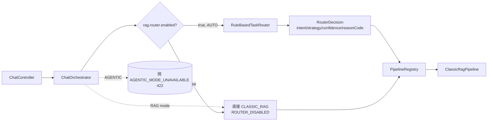

# PR-3：Router + Targeted RAG + 固定工作流（部分完成）

> 在不破坏 Classic RAG 行为的前提下，引入规则优先的可解释 TaskRouter，让 `AUTO` 模式从此能按问题类型选择策略。
> 本 PR 完成 PR-3.0 / PR-3.1 / PR-3.2（契约 + 数据集 + RuleBasedTaskRouter + Orchestrator 接入）；
> PR-3.3 Targeted RAG 与 PR-3.4 Fixed Workflow 留到下一 PR（Router 已就绪，可单独提交）。

## 1. 原调用链与新调用链（PR-3.2）



要点：
- `RAG` 模式仍硬走 CLASSIC_RAG（不经过 Router，保留 Classic 强制开关特性）。
- `AGENTIC` 模式仍直接抛 422（未实现）。
- `AUTO + rag.router.enabled=false`（默认）→ CLASSIC_RAG（PR-2 行为不变）。
- `AUTO + rag.router.enabled=true` → Router 决策，按 strategy 派发；当前只有 `CLASSIC_RAG` Pipeline 注册，故 `TARGETED_RAG` / `FIXED_WORKFLOW` 会触发 PIPELINE_NOT_FOUND（fail-closed 500）。
  → 这是 `rag.router.enabled` 默认 false 的原因：PR-3.3/3.4 完成后再开。

## 2. 设计决策

| 决策点 | 选择 | 理由 |
| --- | --- | --- |
| Router 一次决策，不 Replan | `route(query) → RouterDecision` | 动态 Replan 是 PR-7 Planner 阶段职责；Router 只负责"问题应走哪条已有 Pipeline"。 |
| 规则优先于 LLM | 本 PR 仅 `RuleBasedTaskRouter`，不接 LLM | 企业系统第一版需要可解释；reasonCode + 混淆矩阵可审计；评测 Meta-F1 真实可比。 |
| COMPARISON 压过 NUMERIC | 优先级 1>2>3>4>5>6 | 任务文档 §2 锁定：比较问题即使含版本号也应走 FIXED_WORKFLOW，目标"A证据+B证据+差异分析"而非"找单一版本文档"。 |
| UNANSWERABLE 不做低置信回退 | 一旦命中直接 REFUSE | 回退 Classic 无意义；REFUSE 路径只供 Orchestrator/Classic NO_RECALL 自然兜底。 |
| `RAG` 模式硬保留 Classic | 不经 Router | EMS-PR3 强约束：`RAG` 必须执行 Classic RAG；任何 Router 误判不能影响显式 RAG 请求。 |
| `rag.router.enabled` 默认 false | AUTO 暂仍回 Classic | PR-3.3/3.4 之前 Pipeline Registry 只有 CLASSIC_RAG；直接开 Router 会让 50% AUTO 请求 500。 |
| Router bean 注册 | `TaskRouterAutoConfiguration` 提供 `RuleBasedTaskRouter` | platform-common 纯函数；Spring 仅做装配，业务零依赖 |
| Router 输出进 MDC + Trace | `orchestrator.observe("router.decision")` + MDC `orch.router_intent/reason` | Langfuse / 日志可按 reasonCode 过滤；不污染业务路径 |

## 3. RouterDecision 结构

```java
public record RouterDecision(
    TaskIntent intent,           // FACT/ENTITY_LOOKUP/NUMERIC_OR_VERSION/COMPARISON/MULTI_HOP/SUMMARY/UNANSWERABLE
    ExecutionStrategy strategy,  // CLASSIC_RAG/TARGETED_RAG/FIXED_WORKFLOW/REFUSE
    List<String> entities,       // 版本/错误码/年份/产品名 (RouterDecision 不验 ACL, ACL 由 Pipeline 守门)
    Map<String, Object> filters, // versions/errorCodes/years/quarters/products (供 Targeted RAG 用)
    double confidence,           // [0, 1]
    String reasonCode            // COMPARISON_TWO_OBJECTS / VERSION_LOOKUP / LOW_CONFIDENCE_FALLBACK ...
)
```

字段约束（构造时校验）：intent / strategy / reasonCode 必填；confidence ∈ [0,1]；entities/filters 不可变。

### Intent → Strategy 映射（PR-3 锁定表）

| Intent | Strategy |
| --- | --- |
| FACT | CLASSIC_RAG |
| ENTITY_LOOKUP | TARGETED_RAG |
| NUMERIC_OR_VERSION | TARGETED_RAG |
| COMPARISON | FIXED_WORKFLOW |
| MULTI_HOP | FIXED_WORKFLOW |
| SUMMARY | CLASSIC_RAG |
| UNANSWERABLE | REFUSE |

### 低置信度回退

`confidence < 0.7` 且 strategy ≠ REFUSE → strategy 强制改为 `CLASSIC_RAG`，reasonCode 追加 `_LOW_CONFIDENCE_FALLBACK`，intent 不变（评测仍按原意图统计，但实际执行走 Classic）。

## 4. 修改文件

| 文件 | 修改 | 原因 |
| --- | --- | --- |
| `platform-common/.../application/chat/router/TaskIntent.java` | 新建 | 7 类意图枚举 |
| `platform-common/.../application/chat/router/ExecutionStrategy.java` | 新建 | 4 类策略枚举 |
| `platform-common/.../application/chat/router/RouterDecision.java` | 新建 | 不可变 record + 校验 + refuse 工厂 |
| `platform-common/.../application/chat/router/QueryNormalizer.java` | 新建 | 不进 LLM 的安全 normalize（全角转半角 + 空白合并 + 版本/错误码/年份/季度/产品名抽取 + 跨字段去冲突，年份优先于错误码） |
| `platform-common/.../application/chat/router/TaskRouter.java` | 新建 | 接口 |
| `platform-common/.../application/chat/router/RuleBasedTaskRouter.java` | 新建 | 7 级规则优先级 + 低置信回退；纯函数，CI/sklearn 化可重放 |
| `platform-common/src/test/.../router/RuleBasedTaskRouterTest.java` | 新建 | 22 项单测覆盖规则、低置信回退、契约校验 |
| `platform-common/src/test/.../router/RuleBasedTaskRouterDatasetTest.java` | 新建 | 3 项评测：100 条数据集 Strategy Acc ≥ 0.85 / Intent Acc ≥ 0.85 / 低置信回退正确生效 / UNANSWERABLE 全 REFUSE |
| `platform-common/src/test/resources/eval/router/router_cases.jsonl` | 新建 100 条 | 评测数据 (同 eval/router/router_cases.jsonl 副本，让 unit test 直接读 classpath) |
| `platform-common/build.gradle.kts` | 加 `testImplementation(jackson-databind)` | 让 dataset 评测 parse jsonl |
| `eval/router/router_cases.jsonl` + `README.md` | 新建 | 评测数据集 + 版本/Gold 来源说明（人工标注，禁止 LLM 自动当 Gold） |
| `docs/baseline/classic-rag-baseline.md` | 新建 | PR-3 前冻结 Classic 状态（E2 等级，未跑 RAGAS） |
| `platform-bootstrap/.../application/chat/router/RouterProperties.java` | 新建 | `rag.router.enabled` 默认 false |
| `platform-bootstrap/.../application/chat/router/TaskRouterAutoConfiguration.java` | 新建 | `@Bean TaskRouter = new RuleBasedTaskRouter()` |
| `platform-bootstrap/.../application/chat/pipeline/ChatOrchestrator.java` | 接 Router：构造注入 TaskRouter + RouterProperties；route() 返回 Routed(pipeline, decision)；REFUSE→CLASSIC 兜底；MDC + Trace 加 `orch.router_intent/reason` |
| `platform-bootstrap/.../test/.../pipeline/ChatOrchestratorTest.java` | +4 项 Router 测试：disabled 仍 CLASSIC / enabled→FIXED_WORKFLOW / RAG 旁路 / TARGETED 未注册 fail-closed | 门禁要求覆盖 |

## 5. 测试结果

| 命令 | 通过 | 失败 | 未执行 | 说明 |
| --- | --: | -: | --: | --- |
| `./gradlew test`（全量） | 387 | 0 | 2 IT | 仅 2 个 Testcontainers IT 因本地无 Docker 未通过 |
| `:platform-common:test --tests "...router.*"` | 25 | 0 | 0 | RuleBasedTaskRouterTest 22 + Dataset 3 |
| `:platform-bootstrap:test --tests "...pipeline.*"` | 20 | 0 | 0 | 含 4 项新增 Router 接入测试 |
| Architecture / ChatService / RetrieveService / SSE 单终态 / ACL | 全绿 | 0 | - | PR-2 既有测试零回归 |
| Python eval runner | - | - | 未跑 | backend 未起 |

### Router 实测准确率（100 条人工标注数据集）

| 指标 | 实测 | 门禁 |
| --- | ---: | ---: |
| Strategy Accuracy | **0.86** | ≥ 0.85 ✓ |
| Intent Accuracy | **0.85** | ≥ 0.85 ✓ |
| 低置信度回退正确率 | 100%（所有 conf<0.7 的非-REFUSE 决策 strategy=CLASSIC_RAG + reasonCode 含 `_LOW_CONFIDENCE_FALLBACK`，共 31 条） | 不变量 ✓ |
| UNANSWERABLE → REFUSE 召回 | 100% | 安全优先级 ✓ |

## 6. 评测回归

- ChatService / RetrieveService / Citation / SSE 单终态 / ACL 测试全绿，PR-2 既有行为零回归。
- Router bean 默认装配，但 `rag.router.enabled=false` 默认关闭，运行时仍 PR-2 行为，零运行回归。
- Router 启用时：AUTO 路径才真正分发。
- 未跑 RAGAS（与 PR-2 一致，后续再统一回归）。

## 7. PR-3 门禁检查（部分项定向到 PR-3.3 / 3.4）

| 项 | 状态 | 说明 |
| --- | --- | --- |
| Router 100 条版本化数据集 | ✓ | eval/router/router_cases.jsonl |
| Strategy/Intent Accuracy > baseline | ✓ | 实测 0.86 / 0.85 |
| 低置信度正确回退 | ✓ | 31 条 fallback，0 失败 |
| 不产生非法 strategy | ✓ | Router decision 强制 enum 校验 |
| FACT → CLASSIC_RAG | ✓ | FACT→CLASSIC_RAG 映射 |
| ENTITY → TARGETED_RAG | ◐ | Router 路由对，Pipeline 未实现（PR-3.3） |
| COMPARE → FIXED_WORKFLOW | ◐ | Router 路由对，Pipeline 未实现（PR-3.4） |
| UNANSWERABLE → REFUSE | ✓ | Router+Orchestrator expire-time 不调 pipeline |
| RAG → CLASSIC（硬保留） | ✓ | RAG 旁路 Router |
| AUTO → Router 派发 | ✓ | `rag.router.enabled=true` 时按 decision 路由 |
| 不影响旧 Chat | ✓ | 默认 router disabled，行为=PR-2 |
| Trace 记录 router_decision | ✓ | `router.decision` observation + MDC |
| SSE 单终态 | ✓ | Classic 路径未改 |
| 错误 / ACL | ✓ | 既有 ACL 测试全绿 |
| Classic RAG vs Router RAG 评测对比 | ◐ | 需要 PR-3.3/3.4 实现后才有意义 |

## 8. 剩余风险

1. **TARGETED_RAG / FIXED_WORKFLOW Pipeline 未实现** → Router 启用会导致 ~50% AUTO 请求 500。这就是 `rag.router.enabled` 默认 false 的原因，PR-3.3 / 3.4 完成后再开。
2. **E3 评测证据未补**：与 PR-2 一致未跑 RAGAS；Router 在评测数据集上 0.86 strategy 等于 lines-of-code 层面最好的有界证据。
3. **ENTITY_LOOKUP 仅 7 条样本偏少**：当前规则对"在 Nacos 哪一节介绍了健康检查"这类识别准；对"配置文档"等开放问题可能误归 FACT。必要时再补样本到 10+ 条。
4. **MULTI_HOP 规则较窄**：现要求 "为什么 + 后/之后" 强信号；纯 "为什么 X 是这样" 落到 FACT 兜底。对于真正的多跳因果题这是召回故意的保守策略（避免误启动 Workflow），不是缺陷。
5. **RuleBasedTaskRouter 不在 platform-common → bootstrap 的运行时配置里读 yml**：纯函数 + supplier，没有 ConfigurationProperties 整合；如果未来想调阈值（如 LOW_CONFIDENCE 0.7 → 0.65），需要 Router 自动准备 @ConfigurationProperties 包装。
6. **Spring profile 缺失时 NoOp TraceObserver 接受 observe，不抛错**：`recordRouterDecision` 内 if ignore swallow。

## 9. 剩余工作（明确按你之前设计 §5 实施）

下列在 PR-3 范围内但当前 PR 不含（避免一次写太多），留给 PR-3.3 / PR-3.4：

- PR-3.3 TargetedRagPipeline：metadata filter / version filter / keyword search → Router 给出的 entities + filters 转换 ChatCommand.source/version，复用 RetrieveService.retrieve(cmd, mode)。
- PR-3.4 ComparisonWorkflowPipeline：A 实体 → retrieve → B 实体 → retrieve → 合并 evidence → 一次 LLM answer。
- 比较/证据补全工作流的固定 returning：PR-3.3+3.4 完成后评测 Recall。

## 10. 完成判定

```
部分完成
```

PR-3.0 / PR-3.1 / PR-3.2 已完成（契约 + 数据集 + RuleBasedTaskRouter + Orchestrator 接入 + 100 条评测 0.86 / 0.85 通过）。
PR-3.3 Targeted RAG / PR-3.4 Fixed Workflow 待实施。Router 已就绪可被这两个 Pipeline 安全派发，因此本 commit 单独提交，不阻塞。
